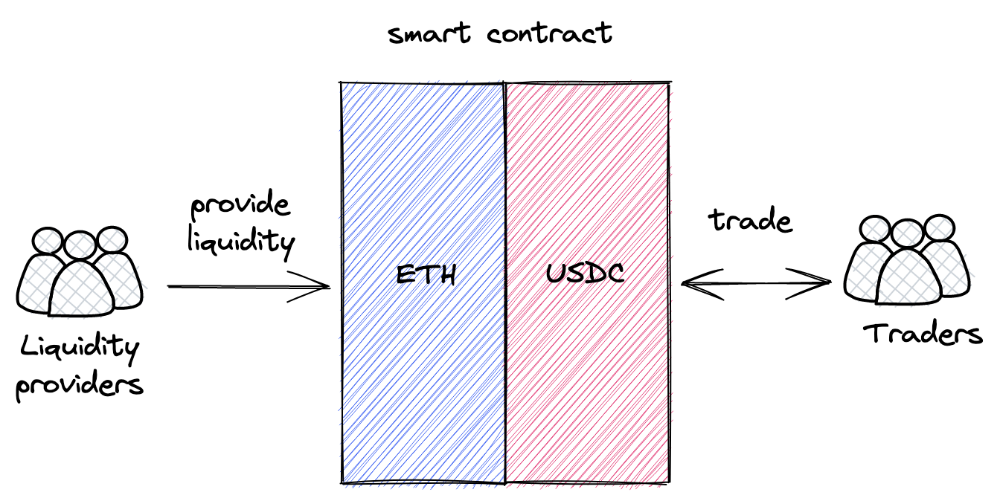

# 交易市场简介

## 中心化交易所(CEX)如何工作
首先一个运行在以太坊(`Ethereum`)上的去中心化交易所(`DEX`)。

`DEX` 的设计模式非常复杂多样，因此我们先来考虑中心化交易所的设计。中心化交易所(`CEX`)的核心为*订单簿(`order book`)*，它存储了用户的所有买单和卖单。订单簿中的每一笔订单都包含了订单成交的价格以及成交数量。

交易能够正常进行的保障是*流动性(`liquidity`)*，也即整个市场中所有可用的资产数目。

假设你希望购买一个衣柜但是没有人售卖，即为没有流动性；如果你希望卖出一个衣柜但是没有人愿意购买，即为市场有流动性但是没有买方。没有流动性，就无法在市场中进行买卖。

在 `CEX` 中，流动性存放在订单簿里。如果某个用户提交了一个卖单，他就为市场提供了流动性；如果某人提交了一个买单，他希望市场有流动性，否则交易就无法进行。

如果市场缺乏流动性，但是交易者仍然希望进行交易，那么就需要*做市商(`market maker`)*。做市商是向市场提供流动性的、拥有大量各种资产的公司或个人。**通过提供流动性，做市商能够从交易中获取利润**。

## 去中心化交易所(DEX)如何工作

毫无疑问，去中心化的交易也需要流动性，并且也需要做市商向市场提供多种资产的流动性。然而，在 `DEX` 中这个过程无法被中心化地处理，我们需要一种**去中心化的做市商**方案。相关解决方案非常多样化，而本书将主要关注 `Uniswap` 提供的方案。

## 自动做市商(AMM)

[链上交易市场的历史](https://bennyattar.substack.com/p/the-evolution-of-amms) 一文提到了一种称作自动做市商(`Automated Market Maker`)的思路。正如其名，这种算法能够自动化完成像做市商一样的工作。更进一步，这种算法是去中心化且无需许可的，也即：
- 没有被任何单个中心化机构控制
- 所有资产并不存储在同一地方
- 任何人在任何地点都能使用

### 什么是自动做市商AMM？

一个 `AMM` 是一套定义如何管理流动性的智能合约。每个单独的交易对（例如 `ETH/USDC`）都是一个单独的智能合约，它存储了 `ETH 和 Token` 的资产并且撮合交易。在这个合约中，我们可以将 `ETH 兑换成 USDC` 或者将 `USDC 兑换成 ETH`。

在 `AMM` 中，一个核心概念为**池子(`pooling`)**：每个合约都是一个存储流动性的*池子*，允许不同的用户（包括其他合约）在其中进行某种方式的交易。`AMM` 中有两种角色，*流动性提供者(`LP`)*以及交易者(`trader`)；这两方通过流动性池进行交互，而交互的方式由合约进行规定且不可更改。

这种交易方法与 `CEX` 的关键区别在于： **智能合约是完全自动化并且不受任何人控制的**。没有经理，没有系统管理员，没有特权用户，一切都没有。这里只有 `LP` 和交易者，任何人都可以担任这两种角色（也可以同时），并且所有的算法都是公开的、程序规定的、不可更改的。

