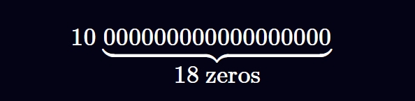

# Fixed point 定点数计算
## Solidity 中的定点运算（以 Solady、Solmate 和 ABDK 为例）

定点数是仅存储分数分子的整数，而分母是隐含的。

在大多数编程语言中，这种类型的运算是不必要的，因为它们有浮点数。但在 `Solidity` 中，这种运算是必要的，因为 `Solidity` 只有整数，而我们经常需要对小数进行运算。

大多数 `DeFi` 智能合约中都有定点数，因此了解它们是必须的。

例如，如果“隐含分母”是 `100`，则保留“`10`”的定点数将被解释为 $\frac{10}{100} = 0.1 $。

`Solidity` 中最常见的定点数是 $10^{18}$ ,以太坊和大多数 `ERC-20` 代币的“小数”数量。当我们读取以太坊地址的余额时，我们会隐式地将该数字除以  $10^{18}$ 确定其 `Ether` 数量。

例如，一个地址的余额为  $10^{19}$ 被解释为有 `10 个 Ether` — 因为除以  $10^{18}$ 是隐含的。

分母为  $10^{18}$ 非常常见，`Solidity` 社区的工程师将其称为“`Wad`”（该名称最初由 `MakerDAO `引入）。有时，`18` 位定点数被解释为将最右边的 `18` 位数字分配给小数，例如，数字“`10`”如下所示：



## 将整数转换为定点数
要将整数转换为定点数，请将整数乘以隐含的分母。例如，`2 Ether` 是 $2 * 10^{18}$ 
### 定点数乘法
要将两个定点数相乘，我们遵循分数乘法的规则：
- 将分子相乘
- 将分母相乘
- 简化结果。
例如：$\frac{x}{d} * \frac{y}{d} = z $,其中 `x,y`表示 定点数， `d` 表示分母，`z` 表示将定点数相乘的结果转成整数

如果我们想把定点数相乘的结果也转化成定点数的话，整式结果需要乘以分母，即 `z * d`

继续化简为： $z * d = \frac{x}{d} * \frac{y}{d} * d = \frac{x * y}{d} $

### 乘以定点的代码示例
`Solady` 库有一个 `mulWad` 数学运算，可以将两个定点数与隐含的 `Wad` 分母相乘（$10^{18}$）。下面，我们展示代码，然后解释它与我们之前的讨论有何关联：

```solidity

    /// @dev The scalar of ETH and most ERC20s.
    uint256 internal constant WAD = 1e18;

    /*´:°•.°+.*•´.*:˚.°*.˚•´.°:°•.°•.*•´.*:˚.°*.˚•´.°:°•.°+.*•´.*:*/
    /*              SIMPLIFIED FIXED POINT OPERATIONS             */
    /*.•°:°.´+˚.*°.˚:*.´•*.+°.•°:´*.´•*.•°.•°:°.´:•˚°.*°.˚:*.´+°.•*/

    /// @dev Equivalent to `(x * y) / WAD` rounded down.
    function mulWad(uint256 x, uint256 y) internal pure returns (uint256 z) {
        /// @solidity memory-safe-assembly
        assembly {
            // Equivalent to `require(y == 0 || x <= type(uint256).max / y)`.
            if gt(x, div(not(0), y)) {
    // x * y > type(uint256).max
                if y { // y != 0
                    mstore(0x00, 0xbac65e5b) // `MulWadFailed()`.
                    revert(0x1c, 0x04)
                }
            }
            z := div(mul(x, y), WAD)
        }
    }
```

假设一个用户有 `1 DAI`（有 `18` 位小数），我们希望计算他们的余额，假设他们的存款获得了 `15%` 的利息。这是一个需要定点运算的明显例子，因为我们不能在 `Solidity` 中直接将一个数字乘以 `1.15`。

```solidity
import "https://github.com/Vectorized/solady/blob/main/src/utils/FixedPointMathLib.sol";

contract C {

    using FixedPointMathLib for uint256;

    uint256 tokenBalance = 1e18;

    function compute15PInterest() public view returns (uint256) {
        return tokenBalance.mulWad(1.15e18);
    } // 1150000000000000000
}
```

## 定点数除法
要将两个定点数相除，我们遵循分数除法的规则：
- 反转除数，将除法变成乘法
- 将分子相乘
- 将分母相乘
- 简化结果。

- 例如：$\frac{x}{d} / \frac{y}{d} = \frac{x}{d} * \frac{d}{y} = z $,其中 `x,y`表示 定点数， `d` 表示分母，`z` 表示将定点数相乘的结果转成整数

如果我们想把定点数相除的结果也转化成定点数的话，整式结果需要乘以分母，即 `z * d`

继续化简为： $z * d = \frac{x}{d} * \frac{d}{y} * d = \frac{x * d}{y} $

```solidity
    /// @dev Equivalent to `(x * WAD) / y` rounded down.
    function divWad(uint256 x, uint256 y) internal pure returns (uint256 z) {
        /// @solidity memory-safe-assembly
        assembly {
            // Equivalent to `require(y != 0 && x <= type(uint256).max / WAD)`.
            if iszero(mul(y, lt(x, add(1, div(not(0), WAD))))) {
                mstore(0x00, 0x7c5f487d) // `DivWadFailed()`.
                revert(0x1c, 0x04)
            }
            z := div(mul(x, WAD), y)
        }
    }
```

## 加定点数
要将两个定点数相加，我们遵循加减法的规则：
- 分母不变
- 将分子相加
- 简化结果。

- 例如：$\frac{x}{d} + \frac{y}{d} = \frac{x + y}{d}  = z $, 其中 `x,y`表示 定点数， `d` 表示分母，`z` 表示将定点数相乘的结果转成整数

如果我们想把定点数相除的结果也转化成定点数的话，整式结果需要乘以分母，即 `z * d`

继续化简为： $z * d = \frac{x + y}{d} * d = x + y $

## 减定点数
要将两个定点数相减，我们遵循加减法的规则：
- 分母不变
- 将分子相减
- 简化结果。

- 例如： $\frac{x}{d} - \frac{y}{d} = \frac{x - y}{d}  = z $, 其中 `x,y`表示 定点数， `d` 表示分母，`z` 表示将定点数相乘的结果转成整数

如果我们想把定点数相除的结果也转化成定点数的话，整式结果需要乘以分母，即 `z * d`

继续化简为： $z * d = \frac{x - y}{d} * d = x - y $

## 二进制与十进制定点数
二进制定点数是分母可以表示为 $2^{n}$

二进制定点数通常用 `Q` 符号表示。例如，`UQ112x112` 使用 $2^{112}$ 作为分母。`U` 表示“无符号”。用于保存` UQ112x112` 的数据类型为 `uint224`: $2^{112} * 2^{112} = 2^{224}$。

另一个例子是，`UQ64x64`（或 `UQ64.64`）将 `uint128` “小数部分”保存在最低有效 `64` 位中，将“整数”保存在最高有效位中。

二进制定点数的优点是我们可以使用节省 `gas` 的左/右位移位而不是乘以分母（将整数转换为定点数时，或在除法时进行右位移位）。

举个基本的例子，考虑以下情况：
- `2` 的二进制表示形式为 `10` 
- `16` 的二进制表示形式为 `10000`
- `16 = 2 *` $2 ^ {3}$, 二进制表示为：`10000 = 10 << 3`

二进制运算如下：

`x` * $2 ^ {112} `== x << 112`

`x` / $2 ^ {112} `== x >> 112`  , `x` 可以是任意数字，只要它适合无符号整数。

### ABDK 库
[ABDK 库](https://github.com/abdk-consulting/abdk-libraries-solidity/tree/master) `fromUInt` 函数代码将 `int256` 的值转成 `Q64.64 = int128` 类型

```solidity
  function fromInt (int256 x) internal pure returns (int128) {
    unchecked {
        require (x >= -0x8000000000000000 && x <= 0x7FFFFFFFFFFFFFFF);
        return int128 (x << 64);
    }
}

/**
 * Convert signed 64.64 fixed point number into signed 64-bit integer number
 * rounding down.
 *
 * @param x signed 64.64-bit fixed point number
   * @return signed 64-bit integer number
   */
    function toInt (int128 x) internal pure returns (int64) {
        unchecked {
            return int64 (x >> 64);
        }
    }

/**
 * Convert unsigned 256-bit integer number into signed 64.64-bit fixed point
 * number.  Revert on overflow.
 *
 * @param x unsigned 256-bit integer number
   * @return signed 64.64-bit fixed point number
   */
    function fromUInt (uint256 x) internal pure returns (int128) {
        unchecked {
            require (x <= 0x7FFFFFFFFFFFFFFF);
            return int128 (int256 (x << 64));
        }
    }

/**
 * Convert signed 64.64 fixed point number into unsigned 64-bit integer
 * number rounding down.  Revert on underflow.
 *
 * @param x signed 64.64-bit fixed point number
   * @return unsigned 64-bit integer number
   */
    function toUInt (int128 x) internal pure returns (uint64) {
        unchecked {
            require (x >= 0);
            return uint64 (uint128 (x >> 64));
        }
    }
```

#### ABDK mul 函数代码
二进制中使用位运算作为 `wad`,乘法示例如下：
```solidity
  function mul (int128 x, int128 y) internal pure returns (int128) {
    unchecked {
      int256 result = int256(x) * y >> 64;
      require (result >= MIN_64x64 && result <= MAX_64x64);
      return int128 (result);
    }
  }
```

## Uniswap V2 定点库
`Uniswap V2` 的定点库非常简单，因为 `Uniswap V2` 对定点数执行的唯一操作是将定点数加法和除法与整数相加或相除。

```solidity
pragma solidity =0.5.16;

// a library for handling binary fixed point numbers (https://en.wikipedia.org/wiki/Q_(number_format))

// range: [0, 2**112 - 1]
// resolution: 1 / 2**112

library UQ112x112 {
    uint224 constant Q112 = 2**112;

    // encode a uint112 as a UQ112x112
    function encode(uint112 y) internal pure returns (uint224 z) {
        z = uint224(y) * Q112; // never overflows
    }

    // divide a UQ112x112 by a uint112, returning a UQ112x112
    // x * d / y
    function uqdiv(uint224 x, uint112 y) internal pure returns (uint224 z) {
        z = x / uint224(y);
    }
}
```

`encode()` 函数将输入 `uint112`乘以定点数 `Q112`, 输出定点数 `uint224`

`uqdiv()` 函数只是将定点数除以整数，不需要额外的步骤。

`Uniswap` 使用此库来累积下方的 `TWAP` 预言机的价格。每次更新时，`TWAP` 都会将最新价格添加到累加器中（用于计算平均价格，但需要额外的步骤，这超出了本文的讨论范围）。由于价格以分数表示，因此定点数是理想的表示方式。

变量 `_reserve0 `和 `_reserve1` 保存池中最新的代币余额，并且是 `uint112`

`price0CumulativeLast` 和 `price1CumulativeLast` 是 `UQ112x112`

`uniswap` 中的 `_update()` 函数使用 `UQ112X112` 编码函数

```solidity
    function _update(uint balance0, uint balance1, uint112 _reserve0, uint112 _reserve1) private {
        require(balance0 <= uint112(-1) && balance1 <= uint112(-1), 'UniswapV2: OVERFLOW');
        uint32 blockTimestamp = uint32(block.timestamp % 2**32);
        uint32 timeElapsed = blockTimestamp - blockTimestampLast; // overflow is desired
        if (timeElapsed > 0 && _reserve0 != 0 && _reserve1 != 0) {
            // * never overflows, and + overflow is desired
            price0CumulativeLast += uint(UQ112x112.encode(_reserve1).uqdiv(_reserve0)) * timeElapsed;
            price1CumulativeLast += uint(UQ112x112.encode(_reserve0).uqdiv(_reserve1)) * timeElapsed;
        }
        reserve0 = uint112(balance0);
        reserve1 = uint112(balance1);
        blockTimestampLast = blockTimestamp;
        emit Sync(reserve0, reserve1);
    }
```

## 向上舍入与向下舍入

定点库通常具有在除法时向上舍入的选项。例如，`Solady` 具有：

- `mulWadUp`— 将两个定点数相乘，但除以 `d` 时向上舍入
- 
```solidity
    /// @dev Equivalent to `(x * y) / WAD` rounded up.
    function mulWadUp(uint256 x, uint256 y) internal pure returns (uint256 z) {
        /// @solidity memory-safe-assembly
        assembly {
            z := mul(x, y)
            // Equivalent to `require(y == 0 || x <= type(uint256).max / y)`.
            if iszero(eq(div(z, y), x)) {
                if y {
                    mstore(0x00, 0xbac65e5b) // `MulWadFailed()`.
                    revert(0x1c, 0x04)
                }
            }
            z := add(iszero(iszero(mod(z, WAD))), div(z, WAD))
        }
    }
```

## Reference
[https://www.rareskills.io/post/solidity-fixed-point](https://www.rareskills.io/post/solidity-fixed-point)

[https://github.com/abdk-consulting/abdk-libraries-solidity/blob/master/ABDKMath64x64.sol](https://github.com/abdk-consulting/abdk-libraries-solidity/blob/master/ABDKMath64x64.sol)

[https://github.com/transmissions11/solmate/blob/main/src/utils/FixedPointMathLib.sol](https://github.com/transmissions11/solmate/blob/main/src/utils/FixedPointMathLib.sol)

[https://github.com/Vectorized/solady/blob/main/src/utils/FixedPointMathLib.sol](https://github.com/Vectorized/solady/blob/main/src/utils/FixedPointMathLib.sol)