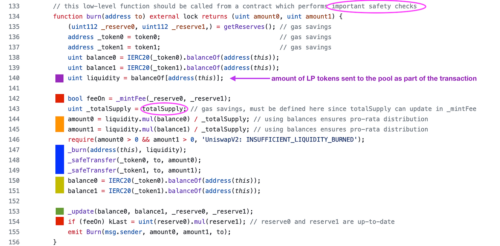
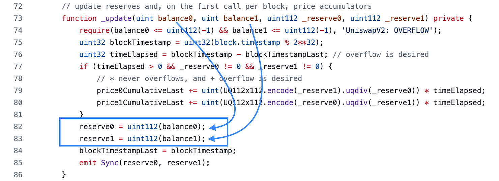
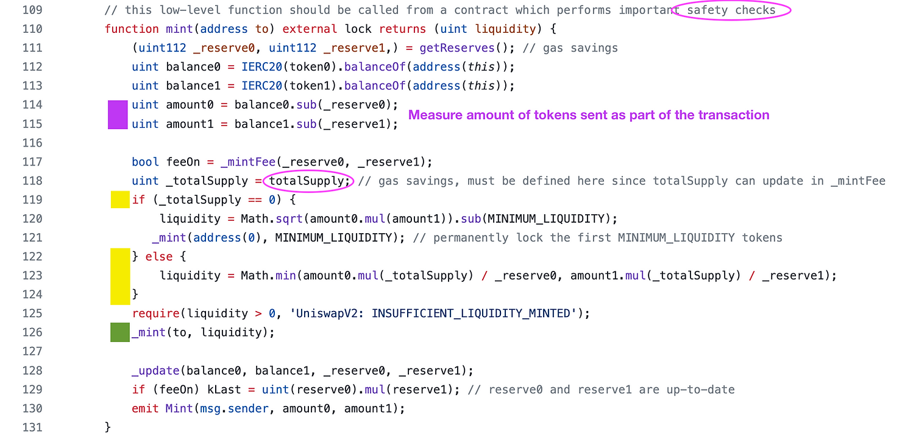

# 流动性
## Uniswap V2 铸币和销毁功能详解
`UniswapV2` 的生命周期是从第一次添加流动性铸造 `LP` 代币（提供流动性，即向池中提供代币）开始，然后其他人添加流动性，进行交换，然后最终流动性提供者烧毁他们的 `LP` 代币来赎回池代币。

事实证明，反向研究这些功能更容易——销毁、铸造流动性、然后铸造初始流动性。

那么我们就从 `Burn` 开始吧。

## Uniswap V2 销毁
在销毁流动性代币之前，池中需要有流动性，所以我们做出这样的假设。我们假设系统中有两种代币：`token0,token1`。

我们在下面注释了刻录功能，我们将解释那些不太明显的部分



- 在第 `140` 行（紫色框）中，流动性由池合约拥有的 `LP` 代币数量来衡量。
  - 假设销毁者在调用销毁之前发送了 `LP` 代币，但建议将其作为一笔交易的一部分。
  - 如果将它们作为两笔交易发送，其他人可能会销毁您的 LP 代币并消除您的流动性！
  - 用户发送给合约的 `LP` 将被销毁。
  - 一般来说，我们可以假设平时，合约的 `LP` 代币余额为零，因为如果 `LP` 代币只是放在配对合约中，有人会销毁它们并免费索取其中的一部分 `token0`
- 第 `144` 行至第 `145` 行的橙色框是计算 `LP` 提供者将收回的金额的地方。
  - `Liquidity / totalSupply` 是他们在 LP 代币总供应量中所占的销毁份额。
  - 基于 `Burn` 的 `LP` 份额，计算应该赎回的 `(token0,token1)` 的数量
  - 如果流动性代币的总供应量为 `1,000`，而他们销毁了 `100 个 LP` 代币，那么他们将占据 `(100/1000 = 10%)` 的 LP 代币
- `147` 到 `149` 行的蓝色框是 `LP` 代币实际被烧毁的地方，并把 `(token0,token1)` 发送给给流动性燃烧者。
- `150-151` 行的黄色框计算新的余额变量，因此 `_update()` 的调用可以更新 `_reserve` 变量。除了更新 `TWAP` 之外，该 `_update` 函数还只是更新 `_reserve` 变量



### 安全检查
假设池中有等量的 `token0` 和 `token1`。
> 这意味着销毁者在销毁 LP 代币时希望收到等量的代币。
> 
> 但是，销毁交易签署交易和确认之间，池中 token 的数量可能会发生变化，uniswapV2 使用 BalanceOf 查询每种代币的在池中的余额。
> 
> 如果销毁者的确认逻辑依赖于接收特定数量），那么如果收到的或略少于预期数量的话，该逻辑可能会崩溃。
> 
> 销毁 LP 时，合约必须准备好接收少于或低于预期的金额

## 当资金池不空时创造流动性
这是 `mint` 流动性函数。



如果池子非空的，即流动性代币的总供应量大于零，在第 `126` 行（绿色框）中铸造给他们的流动性是两个值中较小的一个。

```solidity
liquidity = Math.min(amount0.mul(_totalSupply) / _reserve0, amount1.mul(_totalSupply) / _reserve1);
```
这行代码测量的比例是 `amount0 / _reserve0` ——按 `totalSupplyLP` 代币的比例缩放。

> 假设池子中有 10token0 和 10 token1。
> 
> 如果用户提供 10token0 和 0 token1，他们将获得最小值 (10/10, 0/10) 并获得零流动性代币！

如果我们取两个比率中的最大值? 

> 假设池中目前有 100 个token0 和 1 个 token1，LP 代币的供应量为 1。假设两种代币的总价值（以美元计）为 200
> 
> 那么有人可以再提供一个 Token1 ,按照最大值将会 mint Max(0/10,1/1) = 1 个 LP 代币
> 
> 此时，池子的总流动性代币是 1 + 1 = 2，用户的流动性代币是 1，池子的总价值为 300
> 
> 这意味着用户拥有 50% 的 LP 代币供应量，但是只需存入 100 美元即可。这显然是从其他 LP 提供商那里窃取的。

### 供给比率安全检查
用户可能会尝试遵守代币比率，但如果另一笔交易在他们之前执行并将余额更改为更大的 `token0，token1` ，那么他们将获得比预期更少的流动性代币。

### TotalSupply 安全检查
就像烧毁的情况一样，`totalSupplyLP` 代币的数量可能会随时发生变化，因此必须实施一些滑点保护。

## 首次添加流动性问题
与任何 `LP` 池一样，`Uniswap V2` 需要防御“通货膨胀攻击”。

`Uniswap V2` 的防御方法是先销毁 `MINIMUM_LIQUIDITY =   10**3` 的流动性代币 ，以确保没有人拥有全部 `LP` 代币供应并可以轻松操纵价格。

更有趣的问题是，为什么 `UniswapV2` 要对所供应的代币的乘积取平方根来计算要铸造的 `LP` 数量。

```solidity
if (_totalSupply == 0) {
            liquidity = Math.sqrt(amount0.mul(amount1)).sub(MINIMUM_LIQUIDITY);
           _mint(address(0), MINIMUM_LIQUIDITY); // permanently lock the first MINIMUM_LIQUIDITY tokens
        }
```

白皮书的理由如下：

> Uniswap v2 initially mints shares equal to the geometric mean of the amounts, liquidity = sqrt(xy). This formula ensures that the value of a liquidity pool share at any time is essentially independent of the ratio at which liquidity was initially deposited… The above formula ensures that a liquidity pool share will never be worth less than the geometric mean of the reserves in that pool.
>
> 上述公式确保流动性池份额的价值永远不会低于该池中储备的几何平均值，这部分份额永远不会被burn,同时池子中永远都会预留一部分 (token0,token1)

获得某种直觉的最佳方法之一是插入价值观并观察会发生什么，所以让我们这样做吧。

### 示例：流动性翻倍

假设我们没有用平方根函数来衡量流动性:

> 一开始池子里有 10 个token0，10 个token1
> 
> 后来，池子里有 20 个token0，20 个token1。

直观地看，流动性是翻了两倍还是翻了四倍？

> 因为如果我们不开平方，流动性将从 100（10×10）开始，最终达到 400（20×20）
> 
> 但是，流动性并没有翻四倍。在流动性增长后，每个代币的流动性“深度”翻了一番，而不是翻了四倍。

## Reference
[https://www.rareskills.io/post/uniswap-v2-mint-and-burn](https://www.rareskills.io/post/uniswap-v2-mint-and-burn)