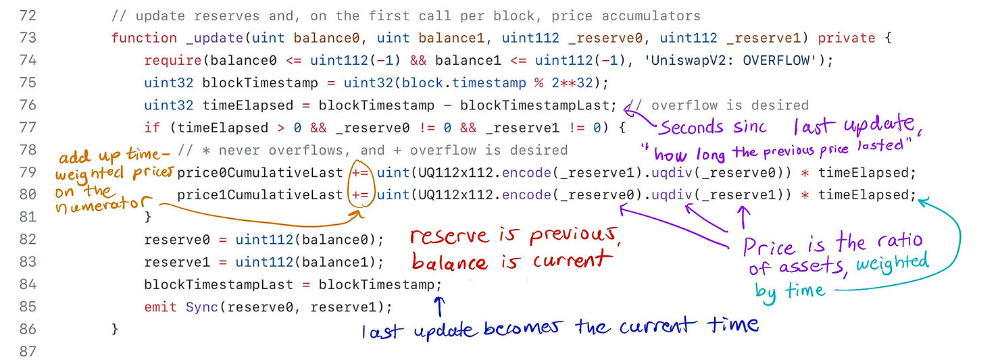
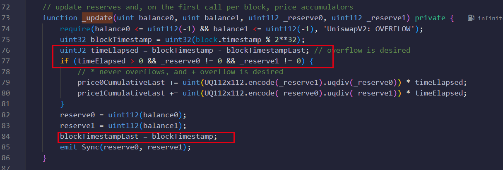

# TWAP Oracle 预言机
## Uniswap 中的“价格”到底是什么？
在一个池子中`（1 Ether, 2000 USDC）`，价格是一个比率，所以它们需要用具有小数点的数据类型来存储（`Solidity` 类型默认情况下没有小数点）。

也就是说，我们说以太坊是 `1 Ether = 2000 USDC`，而 `1 USDC =  0.0005 Ether`（这是忽略两种资产的小数）。

Uniswap 使用小数点两边精度为 112 位的定点数，总共占用 224 位，当与 32 位数字打包时，它会占用一个槽。

## Oracle 定义
计算机科学术语中的预言机是“真相之源”, 价格预言机是价格的来源。

`Uniswap` 在持有两种资产时具有隐含价格，其他智能合约可以将其用作价格预言机。

预言机的目标用户是其他智能合约，因为其他智能合约可以轻松地与 `Uniswap` 通信以确定价格，但是仅采用余额比率来获取当前价格并不安全。

### TWAP 背后的动机
测量池中资产的瞬时快照为闪电贷攻击留下了机会。也就是说，有人可以利用闪电贷进行巨额交易，导致价格暂时大幅波动，然后利用另一个使用该价格做出决策的智能合约。

`Uniswap V2` 预言机通过两种方式防御此问题：

- 它为价格消费者（通常是智能合约）提供了一种机制，可以取一个时间段（由用户决定）的价格平均值。这意味着攻击者必须在几个区块内不断操纵价格，这比使用闪电贷要昂贵得多。
- 它不会将当前余额纳入预言机计算中

如果池子资产流动性不强，或者取平均值的时间窗口不够大，那么资源充足的攻击者仍然可以在足够长的时间里抬高价格（或压低价格），以操纵测量时的平均价格。

## TWAP 的工作原理
`TWAP`（时间加权平均价格）根据价格在某个水平保持的时间来计算价格权重。

- 在过去一天中，某项资产的价格在前 `12` 小时内为 `10` 美元，在后 `12` 小时内为 `11` 美元。
  - 时间加权平均价格：(10 * 12 + 11 * 12) / (12 + 12) = 10.5
- 在过去一天中，资产价格在前 `23` 小时内为 `10` 美元，在最近 `1` 个小时内为 `11` 美元。
  - 时间加权平均价格： (10 * 23 +  11 * 1) / (23 + 1) =  10.0417

一般来说，计算时间加权平均价格的公式为：

TWAP = $\frac{P_{1}T_{1} + P_{2}T_{2} + ... + P_{n}T_{n}}{\sum_{i = 1}^{n}T_{i}}$

此处的 T 是持续时间, 表示价格在该水平保持了多长时间。

## Uniswap V2 _update更新价格



 Uniswap 在每次流动性发生变化时（`mint/burn、swap、sync`），它都会记录新的价格以及之前的价格持续了多长时间。

变量 `price0Cumulativelast` 和 `price1CumulativeLast` 是公开的，因此感兴趣的一方需要对它们进行快照。

### 限制时间窗口
显然，我们一般对矿池成立以来的平均价格不感兴趣。我们只想回顾一段时间（`1 小时、1 天等`）。

以下是 `TWAP` 公式。

`AllTWAP = ` $\frac{P_{1}T_{1} + P_{2}T_{2} + P_{3}T_{3} + P_{4}T_{4} + P_{5}T_{5} + P_{6}T_{6}}{\sum_{i = 1}^{6}T_{i}}  $

price0Cumulativelast = $P_{1}T_{1} + P_{2}T_{2} + P_{3}T_{3} + P_{4}T_{4} + P_{5}T_{5} + P_{6}T_{6}$


如果我们只对 T4 以来的价格感兴趣，那么我们需要执行以下操作

`TWAPFromT4 =` $\frac{P_{4}T_{4} + P_{5}T_{5} + P_{6}T_{6}}{\sum_{i = 4}^{6}T_{i}}$

`price0CumulativelastToT3 =` $P_{1}T_{1} + P_{2}T_{2} + P_{3}T_{3}$

`price0CumulativelastFromT4 = price0Cumulativelast - price0CumulativelastToT3  =` $P_{4}T_{4} + P_{5}T_{5} + P_{6}T_{6}$ 

我们在 $T_{3}$ 结束时快照价格,我们得到了值 `price0CumulativelastToT3`

我们在 $T_{6}$ 结束时快照价格,我们得到了值 `price0Cumulativelast`

`price0Cumulativelast - price0CumulativelastToT3` 就会得到最近窗口的累计价格。如果我们将其除以最近窗口的持续时间$T_{4} + T_{5} + T_{6}$，则得到近期窗口的 `TWAP` 价格。

### 价格累计
UniswapV2 只会计算并累积每个区块中涉及流动性变化的首个交易的价格,防止因为 `MEV` 或 `FlashLoan` 引起的价格过度变动



### Solidity 中仅计算最近 1 小时的 TWAP
如果我们想要 `1 小时的 TWAP`，我们需要预计从现在起 `1` 小时后需要对累加器进行快照。

因此，我们需要访问公共变量 `price0CumulativeLast` 和公共函数 `getReserves()` 来获取上次更新时间，并对这些值进行快照。

```solidity
    function getReserves() public view returns (uint112 _reserve0, uint112 _reserve1, uint32 _blockTimestampLast) {
        _reserve0 = reserve0;
        _reserve1 = reserve1;
        _blockTimestampLast = blockTimestampLast;
    }
```

至少 `1` 小时后，我们可以调用并从 `Uniswap V2` 中获取最新的 `price0CumulativeLast` 值

以下代码为了说明目的而尽可能简单，不建议用于生产。

```solidity
pragma solidity ^0.8.0;

import "@uniswap/v2-core/contracts/interfaces/IUniswapV2Pair.sol";

library UQ112x112 {
    uint224 constant Q112 = 2**112;

    // encode a uint112 as a UQ112x112
    function encode(uint112 y) internal pure returns (uint224 z) {
        z = uint224(y) * Q112; // never overflows
    }

    // divide a UQ112x112 by a uint112, returning a UQ112x112
    function uqdiv(uint224 x, uint112 y) internal pure returns (uint224 z) {
        z = x / uint224(y);
    }
}

contract OneHourOracle {
    using UQ112x112 for uint224; // requires importing UQ112x112

    uint256 public snapshotPrice0Cumulative;
    uint32 lastSnapshotTime;

    function getTimeElapsed() internal view returns (uint32 t) {
        unchecked {
            t = uint32(block.timestamp % 2**32) - lastSnapshotTime;
        }
    }

    function snapshot(IUniswapV2Pair uniswapV2pair) public {
        require(getTimeElapsed() >= 1 hours, "snapshot is not stale");

        // we don't use the reserves, just need the last timestamp update
        (, , lastSnapshotTime) = uniswapV2pair.getReserves();
        snapshotPrice0Cumulative = uniswapV2pair.price0CumulativeLast();
    }

    function getOneHourPrice(IUniswapV2Pair uniswapV2pair)
        public
        view
        returns (uint256 twapPrice)
    {
        require(getTimeElapsed() >= 1 hours, "snapshot not old enough");
        require(getTimeElapsed() < 3 hours, "price is too stale");

        uint256 recentPriceCumul = uniswapV2pair.price0CumulativeLast();

        uint256 timeElapsed = getTimeElapsed() - lastSnapshotTime;
        unchecked {
            twapPrice =
                (recentPriceCumul - snapshotPrice0Cumulative) /
                timeElapsed;
        }
    }
}

```

### 如果上次快照是三个小时前拍摄的怎么办？
如果与之交互的对在过去三个小时内没有交互，则上述合约将无法快照。

解决方案是让预言机在执行快照时调用 `sync` 函数，因为这将在内部调用。

```solidity
    // force reserves to match balances
    function sync() external lock {
        _update(IERC20(token0).balanceOf(address(this)), IERC20(token1).balanceOf(address(this)), reserve0, reserve1);
    }
```

## Reference
[https://www.rareskills.io/post/twap-uniswap-v2](https://www.rareskills.io/post/twap-uniswap-v2)