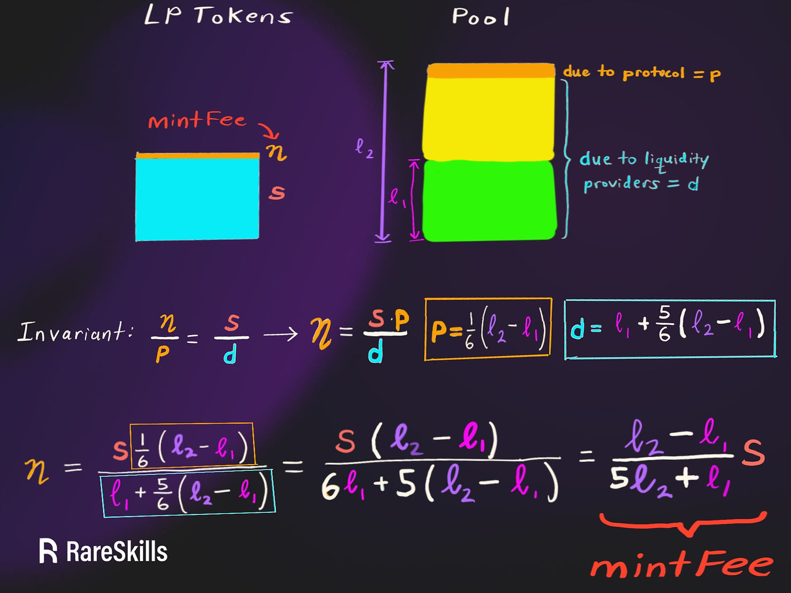
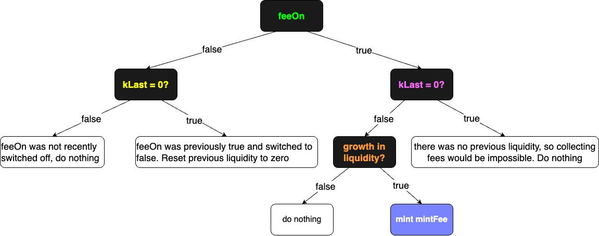
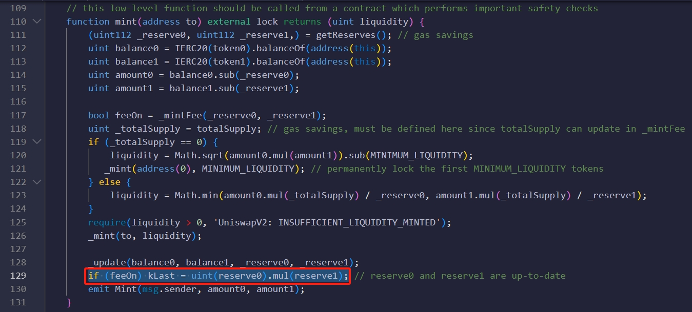

# Uniswap 协议手续费
## Uniswap V2 如何计算 mintFee
`UniswapV2` 的设计目标是将 `1/6` 的 `swapFee` 转入 `Uniswap Protocal`

由于 `swapFeeRatio = 0.3%`，其` 1/6 = 0.05%`，因此每笔 `swap` 交易手续费的 `0.05%` 将计入协议。

### 在交换期间收取协议费用效率低下

`Uniswap` 协议每笔 `swap` 交易收取 `0.05%` 的费用是低效的，因为这需要额外的代币转移。

转移 `ERC20` 代币需要存储更新，因此转移到协议收益地址的成本会高得多。

因此，当流动性提供者调用 `burn` 或 `mint` 时，才会计算累积的费用。 因此可以节省 `gas`。为了收取费用 `mintFee`，合约会计算自上次发生以来收取的费用金额，并向受益人地址铸造足够的 `LP` 代币，以使受益人有权获得 `1/6` 的费用。

流动性是池中代币余额乘积的平方根 `liquidity = Math.sqrt(amount0.mul(amount1))`

### 计算 mintFee 假设
为了实现这一点，Uniswap V2 依赖于以下两个不变量：

- 如果 `mint()` 和 `burn()` 没有被调用，那么池的流动性只会增加
  - 多次 `mint` 期间的 `swap`，会增加池子的流动性。
  - 每笔兑换，都会增加池子的 (token0,token1) 的代币数量
- 流动性的增加纯粹是由于兑换手续费（或捐赠）

### mintFee 计算示例
> 假设在 `T1` 时，流动性池子中存在 `10 个 token0` 和 `10 个 token1`。
>
> 经过大量兑换交易，新的池余额为 40个token0 和 40个token1 
> 
> 此时，流动性从 `10` 增加到 `40`

我们希望铸造足够多的流动性代币，即 `mintFee`，以便协议受益人能够收到资金池全部 `swapFee` 的 `1/6`。

## 推导铸币费公式
在启动协议手续费的前提下，以原始流动性为起点，池子中添加了 `T2-T1` 时间区间的兑换手续费，我们使用以下符号：

- `s`: 流动性代币基准。在 `T2` 时刻，铸造给流动性提供商的流动性代币的数量

- $\eta$: 流动性代币基准。在 `T2` 时刻，池子应该为协议铸造的流动性代币的数量，它应该足以赎回 `1/6` 的利润流动性

- $\rho_{1}$: 流动性基准。在 `T1` 时刻，池子的原始流动性 `Math.sqrt(_reserve0.mul(_reserve0))`

- $\rho_{2}$: 流动性基准。在 `T2` 时刻，经过一段时间的 `swap` 手续费的积累，池子的新流动性值 `Math.sqrt(reserve0.mul(reserve0))`

- `d` : 流动性基准。 经过原始流动性和 `T2-T1` 时间区间的兑换手续费，流动性提供商获取的流动性

- `p`: 流动性基准。经过 `T2-T1` 时间区间的兑换手续费， 池子应该为协议提供的流动性,它应该是时间区间内全部利润流动性的 `1/6`

下图解答了 ,就流动性的变化而言:
$\frac{s}{\eta}$ = $\frac{d}{p}$




### _mintFee()Uniswap V2 的代码
考虑到这一推导，`UniswapV2 _mintFee` 函数的大部分内容应该是不言自明的。以下是一些符号上的变化：

- `T2` 时刻的流动性 $\rho_{2}$ 是 `rootK`
- `T1` 时刻的流动性 $\rho_{1}$ 是 `kLast`
- `T2` 时刻的流动代币数量 `s` 是 `totalSupply`

```solidity
    // if fee is on, mint liquidity equivalent to 1/6th of the growth in sqrt(k)
    function _mintFee(uint112 _reserve0, uint112 _reserve1) private returns (bool feeOn) {
        address feeTo = IUniswapV2Factory(factory).feeTo();
        feeOn = feeTo != address(0);
        uint _kLast = kLast; // gas savings
        if (feeOn) {
            if (_kLast != 0) {
                uint rootK = Math.sqrt(uint(_reserve0).mul(_reserve1));
                uint rootKLast = Math.sqrt(_kLast);
                if (rootK > rootKLast) {
                    uint numerator = totalSupply.mul(rootK.sub(rootKLast));
                    uint denominator = rootK.mul(5).add(rootKLast);
                    uint liquidity = numerator / denominator;
                    if (liquidity > 0) _mint(feeTo, liquidity);
                }
            }
        } else if (_kLast != 0) {
            kLast = 0;
        }
    }
```
- `feeOn = false`,不会为协议铸造流动性代币

- `feeOn = false`，非零的 `kLast` 值置 零，不用在每次 `mint/burn` 时更新 `kLast` 的值

- `feeOn = true`，但流动性没有增长，期间没有 `swap` 手续费的积累，不会为协议铸造流动性代币

- `feeOn = true`, 并且存在流动性增长（期间有 `swap` 手续费的积累），因此会为协议铸造流动性代币



## Where klast gets updated
在 `mint/burn` 引起的 流动性代币 `totalSupply` 变化的函数中，会进行 `kLast` 的更新。将 `kLast` 更新为当前行为的流动性。


## Reference
[https://www.rareskills.io/post/uniswap-v2-mintfee](https://www.rareskills.io/post/uniswap-v2-mintfee)