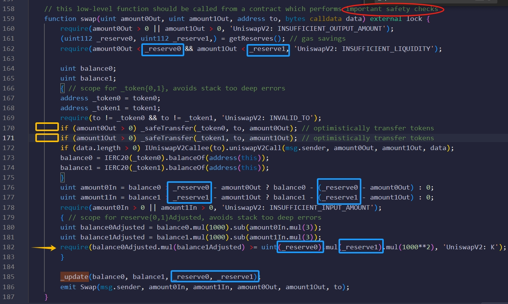
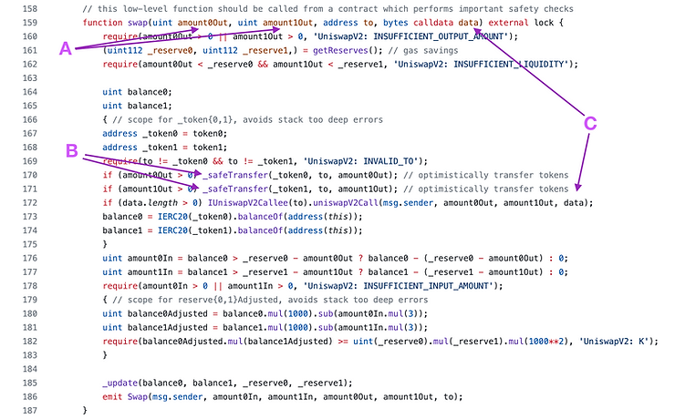
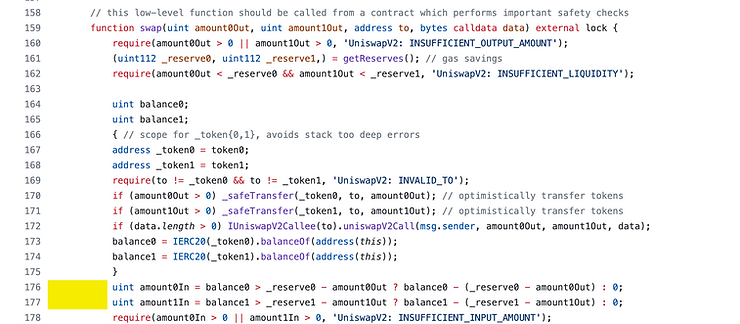
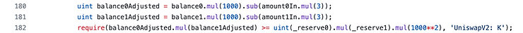
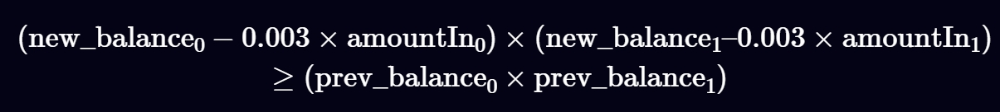
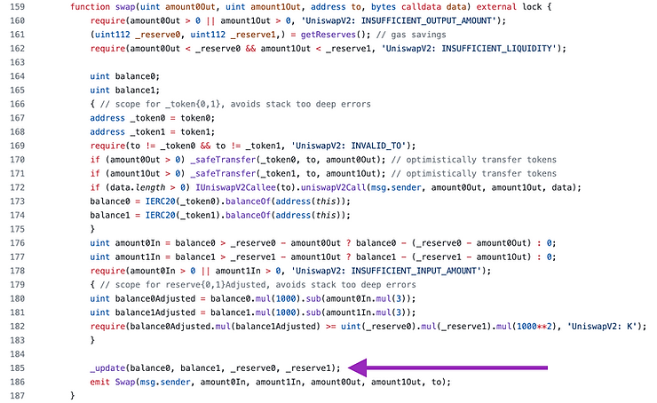
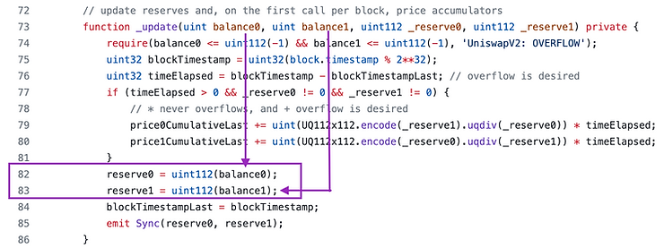

# Swap



- 在第 `170-171` 行（用黄色框表示），该函数直接转出交易者在函数参数中请求的代币数量。
  - 函数内部没有转入代币的地方。
  - `swap` 代码中不存在代币转入的地方，但这并不意味着我们可以直接调用 `swap` 并提取我们想要的所有代币！
- 我们之所以可以立即移除代币，是为了可以进行闪电贷。
  - 当然，第 `182` 行的 `require` 语句（橙色箭头）将要求我们连本带利地偿还闪电贷。
- 在该函数的顶部，有一条注释，指出该函数应从另一个实施重要安全检查的智能合约调用。
  - 这意味着该函数缺少安全检查（红色下划线）
- 变量 _`reserve0` 和 _`reserve1` （蓝色下划线）在第 `161` 行、第 `176-177` 行、第 `182` 行被读取，但是在本函数中没有被写入。
- 第 `182` 行（橙色箭头）并不严格检查 `X × Y = K`。它检查 `balance1Adjusted × balance2Adjusted ≥ K`。
  - 这是唯一执行“有趣”操作的 `require` 语句。
  - 其他 `require` 语句检查值是否不为零，或者您是否没有将代币发送到它们自己的合约地址。
- `balance0` 和 `balance1` 直接使用 `ERC20 balanceOf` 从 `pair` 合约的实际余额中读取
- 第 `172` 行（黄色框下方）仅当数据非空时才执行，否则不执行

利用这些观察结果，我们将逐一理解该函数的一个特征。

## 闪电借贷
用户不必使用兑换功能来交易代币，它可以纯粹用作闪电贷。



借款合约只需请求他们希望借入的代币数量（`A`），无需抵押，然后它们将被转移到合约（`B`）。

函数调用时需要提供的数据作为函数参数(`C`)传入，然后传递给实现 `IUniswapV2Callee`。

`uniswapV2Call` 函数必须偿还闪电贷和费用，否则交易将被撤销。

## 交换需要使用智能合约
`Uniswap V2` “衡量”发送的代币数量的方式在第 `176` 行和 `177` 行完成，如下方黄色框标记。



请记住，_`reserve0` 和 _`reserve1` 不会在此函数内更新。它们反映的是作为交换的一部分发送新代币集之前的合约余额。

对于该对中的两个标记，可能会发生以下两种情况之一：

- 该池中某种代币的数量净增加。 
- 该池中某种代币的数量净减少（或没有变化）。

代码通过以下逻辑确定发生了哪种情况：
```go
currentContractbalanceX > _reserveX - _amountXOut

// alternatively

currentContractBalanceX > previousContractBalanceX - _amountXOut
```
如果测量到净减少量，三元运算符将返回零，否则它将测量代币的净收益。
```go
amountXIn = balanceX - (_reserveX - amountXOut)

// alternatively

amountXIn = currentContractBalanceX - (previousContractBalanceX - amountXOut)
```
由于第 `162` 行的 `require` 语句，所以情况总是 `_reserveX > amountXOut`。


一些例子。

- 假设我们之前的余额是 `10`，`amountOut = 0` ，`currentBalance = 12`。
  - 满足：`currentContractBalanceX > previousContractBalanceX - _amountXOut => 12 > 10-0`
  - `amountXIn = 12 -(10-0) = 2`,用户存入了 `2` 个代币。
- 假设我们之前的余额为 `10`，`amountOut = 7`，`currentBalance = 3`。
  - 不满足：`currentContractBalanceX > previousContractBalanceX - _amountXOut => 3 > 10-7`
  - 这意味着 `amountXIn = 0`,用户存入了 `0` 个代币。 
- 假设我们之前的余额是 `10`，`amountOut = 7`，`currentBalance = `2。 
  - 不满足：`currentContractBalanceX > previousContractBalanceX - _amountXOut => 2 > 10-7`
  - 这意味着 `amountXIn = 0`,用户存入了 `0` 个代币。
- 假设我们之前的余额是 `10`，`amountOut = 6`， `currentBalance = 18`
  - 满足：`currentContractBalanceX > previousContractBalanceX - _amountXOut => 18 > 10-6`
  - 这意味着 `amountXIn = 18-(10-6) = 14`,用户存入了 `14` 个代币。
  - 那么用户“借”了 `6` 个代币，但偿还了 `14` 个代币。

结论：如果代币有净收益，则 `amount0In` 和 `amount1In` 将反映净收益，

如果代币有净亏损，则 `amount0In` 和 `amount1In` 将为零。

## 平衡 XY = K
现在我们知道用户发送了多少个 `Token`，让我们看看如何强制` XY >= K`



`Uniswap V2` 每次交换收取 `0.3%` 的硬编码费用，这就是我们看到数字 `1000 和 3` 的原因

## 费用会计
但我们不仅希望 `K` 变得更大，还希望它至少增大到强制执行` 0.3%` 费用的量。

具体来说，`0.3%` 的费用适用于我们的交易规模，而不是资金池的规模。

它仅适用于流入的代币，而不适用于流出的代币。以下是一些示例：

> 假设我们放入 1000 个 token0，取出 1000 个 token1，我们需要为 token0 支付 3 的费用，而为 token1 则无需支付费用。
>
> 假设我们借了 1000 个 token0，但没有借 token1。我们将不得不再投入 1000 个 token0，并且需要为此支付 0.3% 的费用——3 个 token0。
>
> 请注意，如果我们快速借入其中一种代币，其费用与以相同金额交换该代币的费用相同。您需要为存入的代币支付费用，而不是为取出的代币支付费用。但如果您不存入代币，则无法借入或交换。




也就是说，新的余额必须增加 `0.3%`。在代码中，公式通过将每个项乘以 `1,000` 来缩放，因为 `Solidity` 没有浮点数，但数学公式显示了代码试图完成的任务。

## 更新储备
现在交易已完成，那么“先前余额”必须替换为当前余额。这发生在 `swap()` 末尾对 `_update()` 函数的调用中。



### _update() 函数
这里有很多逻辑来处理 `TWAP` 预言机，但我们现在只关心第` 82` 行和第 `83` 行，其中存储变量 `reserve0` 和 `reserve1` 被更新以反映更改后的余额。参数` _reserve0` 和 `_reserve1` 用于更新预言机，但它们不会被存储。



## 安全检查
有两件事可能会出错：

`amountIn` 不是强制最优的，因此用户可能会为交换支付过多的费用

`AmountOut` 不具备灵活性，因为它是作为参数提供的。如果 `amountIn` 相对于 `amountOut` 不够，交易将撤销，`gas` 将被浪费。

如果有人抢先交易（有意或无意），并将池中的资产比例改变到不利的方向，就会发生这些情况。

## Reference
[https://www.rareskills.io/post/uniswap-v2-swap-function](https://www.rareskills.io/post/uniswap-v2-swap-function)