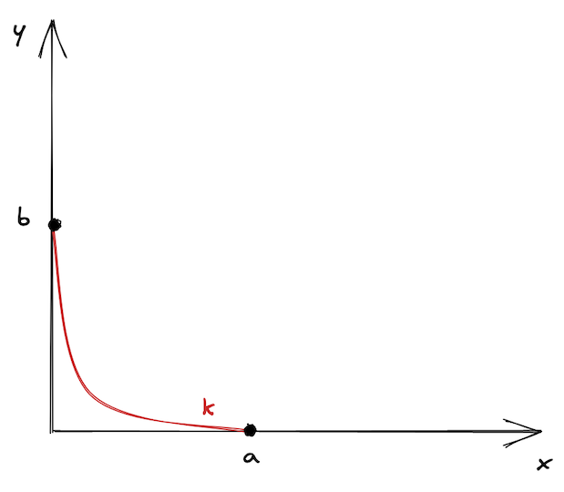

# Uniswap V3简介

> 本章节主要讲述了 [Uniswap V3白皮书](https://uniswap.org/whitepaper-v3.pdf)中的内容。同样，假设你没有理解本章的所有概念也没有关系，我们在后面章节直接看代码可能会更清晰。

为了更好地理解 `UniswapV3` 的创新之处在哪里，我们首先来看 `UniswapV2` 的缺点有哪些。

`UniswapV2` 使用 `AMM` 机制实现了一个通用的交易市场。 ·然而，并不是所有的交易对都是一样的，交易对可以根据价格的波动性分为以下两类：

1. 价格波动性中等或较高的代币对。大多数代币对都属于这一类，因为绝大多数代币并没有锚定(`pegged to`)到某些东西，因此其价格随着市场波动而波动。
2. 价格波动性低的代币对。这一类包含了有锚定的代币，主要为稳定币`：USDT/USDC`，`USDC/DAI`，`USDT/DAI` 等等。也包括 `ETH/stETH`，`ETH/rETH`（一些 `wrapped ETH`）等类型。

这些不同的代币对，对于流动性池的配置有不同的要求。最主要的区别在于，锚定代币对需要非常高的流动性来降低大额交易对其价格的影响。但是 `USDC,USDT` 的价格必须保持在1附近，无论我要买卖多大数目的代币。由于 `UniswapV2` 的通用 `AMM` 算法对于稳定币交易并没有很好的适配，所以在稳定币的交易中其他的 `AMM`（主要是[Curve](https://curve.fi)）更加流行。

导致这个问题出现的原因是，`UniswapV2` 池子的流动性是分布在无穷区域上的——池子允许在任何价格的交易发生，从 `0` 到正无穷 ${+ \infty}$：

这听起来好像不是一个坏事，但事实上它导致了资产利用效率的不足。一个资产的历史价格通常是在某个区间内的，不管这个区间是大还是小。
比如，`ETH` 的历史价格大致在 `1990 ~2100` 这个区间（数据来源 [CoinMarketCap](https://coinmarketcap.com/currencies/ethereum/)）。
在今天（2025年3月），1 个 ETH 的现货价格是 `1991` ，没有人会愿意用 `5000` 购买一个 `ETH`，所以在这个价格上提供流动性是毫无用处的。因此，在远离当前价格区间的、永远不会达到的某个点上提供流动性是毫无意义的。

## 集中流动性
`UniswapV3` 引入了 *集中流动性(`concentrated liquidity`)* 的概念：
`LP` 可以选择他们希望在哪个价格区间提供流动性。
这个机制通过将更多的流动性提供在一个相对狭窄的价格区间，来大大提高资产利用效率；
这也使 `Uniswap` 的使用场景更加多样化：它现在可以对于不同价格波动性的池子进行不同的配置。
这就是 `V3` 相对于 `V2` 的主要提升点。

简单地来说，一个 `UniswapV3` 的交易对由许多个 `UniswapV2` 的交易对构成。
`V2` 与 `V3` 的区别是:
- 在 `V3` 中，一个交易对有许多的**价格区间**，而每个价格区间内都有**一定数量的资产**。从零到正无穷的整个价格区间被划分成了许多个小的价格区间，每一个区间中都有一定数量的流动性。
- 而更关键的点在于，在每个小的价格区间中，**工作机制与 UniswapV2** 完全一样。这也是为什么我们说一个 `UniswapV3` 的池子就是许多个 `V2` 的池子。

下面，我们来对这种机制进行可视化。我们并不是重新选择一个有限的曲线，而是我们把它在价格 $a$ 与价格 $b$ 之间的部分截取出来，把它们当作是是曲线的边界。更进一步，我们把曲线进行平移使得边界点落在坐标轴上，于是得到了下图：

> 它看起来或许有点单调， 因此 UniswapV3 有许多的价格区间——这样它们就不会感到孤单了 🙂

正如我们在前一章中讲到的那样，交易 `token` 使得价格在曲线上移动，而价格区间限制了价格点的移动。当价格移动到曲线的一端时，我们说这个池子被**耗尽了**：其中一种代币的资产变成了 `0`，无法再购买这种代币（当然，仅仅指在这个价格区间内）。

假设起始价格在上图中曲线的中间一点。为了到达点 $a$，我们需要购买池子里所有的 $y$ 来使得池子里的 $x$ 最大化；为了到达点 $b$，我们需要买光池子里的 $x$ 从而使 $y$ 最大化。在这两个点，池子里都只剩一种 token。

> 一个有趣的事实：根据这个原理，可以利用V3的价格区间来挂限价单。

如果当前价格区间池子被耗尽将会发生什么？价格点会滑动到下一个价格区间。如果下一个价格区间不存在，这笔交易就会以部分成交而结束——我们将在本书后面的部分看到其如何实现。

下面一图展示了 [USDC/ETH 池子的流动性分布](https://info.uniswap.org/#/pools/0x8ad599c3a0ff1de082011efddc58f1908eb6e6d8):

可以看到，大量流动性集中在现价的附近，而较远的价格区间中的流动性较少——
这是因为 `LP` 更希望提高它们的资产利用效率。当然，整个区间也不是无穷的，在图片右侧也显示了其上界。

## Uniswap V3 的数学原理

在数学原理上，`V3` 是基于 `V2` 的：它们使用了相同的底层公式，但实际上 `V3` 使用的是*增强版*。

为了处理价格区间之间的转换，简化流动性管理，以及避免取整出现问题，`V3` 使用了下面这些新的标识：

$$L = \sqrt{xy}$$

$$\sqrt{P} = \sqrt{\frac{y}{x}}$$

$L$ 被称作 *流动性数量*。池子中的流动性是两种 token 资产数量的组合。我们知道，按照公式，两种代币数量乘积为 $k$，因此我们可以用 $\sqrt{xy}$ 来衡量池子流动性。$L$ 实际上是 $x$ 和 $y$ 的几何平均数。

$y/x$ 是 token0 相对于 token1 的价格。由于池子里两种代币的价格互为倒数，我们在计算中仅使用其中一个( Uniswap V3使用的是 $y/x$)。token1 相对于 token0 的价格即为 $\frac{1}{y/x}=\frac{x}{y}$。类似地， $\frac{1}{\sqrt{P}} = \frac{1}{\sqrt{y/x}} = \sqrt{\frac{x}{y}}$.

我们使用 $\sqrt{P}$ 而不是 $P$ 有两个原因：

1. 平方根计算并不精确并且会引入取整的问题。因此，更简单的方法是我们干脆就在合约中存平方根的结果，而不是在合约中计算它。（合约中并不存储 $x$ 和 $y$ ）
2. $\sqrt{P}$ 与 $L$ 之间有一个有趣的关系：$L$ 也表示了输出数量的变化与 $\sqrt{P}$ 的变化之间的关系：

    $L = \frac{\Delta y}{\Delta\sqrt{P}}$

> 证明:
$L = \frac{\Delta y}{\Delta\sqrt{P}}$

$$\sqrt{xy} = \frac{y_1 - y_0}{\sqrt{P_1} - \sqrt{P_0}}$$

$$\sqrt{xy} (\sqrt{P_1} - \sqrt{P_0}) = y_1 - y_0$$

$$\sqrt{xy} (\sqrt{\frac{y_1}{x_1}} - \sqrt{\frac{y_0}{x_0}}) = y_1 - y_0$$

$$\sqrt{y_1^2} - \sqrt{y_0^2} = y_1 - y_0$$ 

$$y_1 - y_0 = y_1 - y_0$$

（译者注：第四步到第五步，$\sqrt{xy} = \sqrt{x_0y_0} = \sqrt{x_1y_1}$ ）

## 价格

同样，我们并不需要计算准确的价格——我们可以直接计算获得的 `token` 数量。并且，由于我们在合约中并不存储 $x$ 和 $y$，我们将仅通过 $L$ 和 $\sqrt{P}$ 进行计算。

根据上文中的公式，我们能得到 $\Delta y$：

$$\Delta y = \Delta \sqrt{P} L$$

> 见上述证明中的第三步。

正如上面所说，双方的价格互为倒数。因此，$\Delta x$ 的公式为：

$$\Delta x = \Delta \frac{1}{\sqrt{P}} L$$

$L$ 和 $\sqrt{P}$ 让我们不再需要存储和更新池子资产数量。并且，我们也并不需要每次都重新计算 $\sqrt{P}$ 因为我们从上述公式可以得到 $\Delta \sqrt{P}$。

## Ticks

正如我们前面说到的，`V2` 中的无穷价格区间在 `V3` 中被分成了更小的价格区间，每个区间都由上下界端点进行限制。为了进行这些边界的协调，`V3` 引入了 *`ticks`*。

在 `V3`，整个价格区间由离散的、均匀分布的 `ticks` 进行标定。每个 `tick` 有一个 `index` 和对应的价格：

$$p(i) = 1.0001^i$$

$p(i)$ 即为 tick $i$ 的价格. 使用 1.0001 的幂次作为标定有一个很好的性质：两个相邻 tick 之间的差距为 0.01% 或者*一个基点。*

> 基点 (1% 的百分之一，或者 0.01%，或者 0.0001)是在金融中用来衡量百分比的一个单位。你可能在央行宣布对于利率的调整中听过基点这个名词。

正如我们之前讨论的，`UniswapV3` 存储的是 $\sqrt{P}$ 而不是 $P$。所以这个公式实际上是：

$$\sqrt{p(i)} = \sqrt{1.0001}^i = 1.0001 ^{\frac{i}{2}}$$

我们得到的值大概是这样：$\sqrt{p(0)} = 1$, $\sqrt{p(1)} = \sqrt{1.0001} \approx 1.00005$, $\sqrt{p(-1)} \approx 0.99995$.

`Ticks` 可以为正也可以为负，并且显然它不是无穷的。
`V3` 把$\sqrt{P}$ 存储为一个 `Q64.96` 类型的定点数，使用 64 位作为整数部分，使用 96 位作为小数部分。因此，价格的取值范围是 $[2^{-128}, 2^{128}]$，ticks 的取值范围是：

$$[log_{1.0001}2^{-128}, log_{1.0001}{2^{128}}] = [-887272, 887272]$$

> 如果希望对于 Uniswap V3 的数学原理有更深的理解，推荐[这篇技术文章](https://atiselsts.github.io/pdfs/uniswap-v3-liquidity-math.pdf)，作者为 [Atis Elsts](https://twitter.com/atiselsts)

