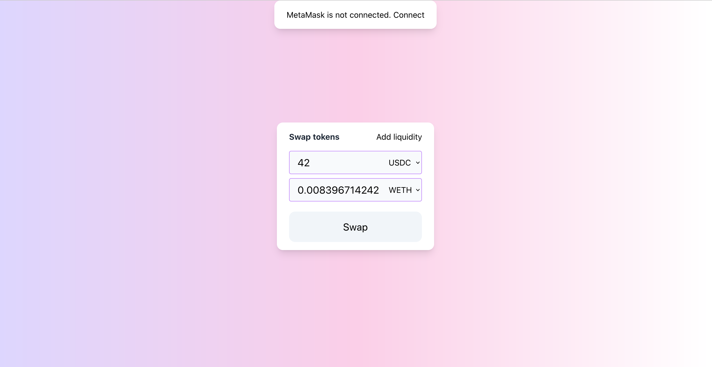
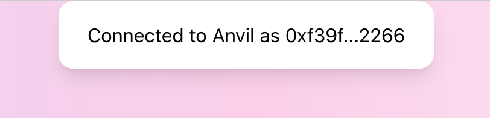

# 用户界面

现在，我们可以进行这个 milestone 的最后一步了——搭建一个 UI！




由于搭建前端 app 并不是本书的主要目的，本书将不会讲解如何从头搭建一个这样的前端，而是展示如何使用 MetaMask 与智能合约进行交互。

> 如果你希望自己尝试这个 app，在本地运行它，你可以在代码仓库中的 [ui](https://github.com/Jeiwan/uniswapv3-code/tree/milestone_1/ui)文件夹找到对应代码。这就是一个简单的React 应用，本地运行只需要在 `App.js` 中设置合约地址，然后运行 `yarn start`。

## 相关工具一览

### 什么是 MetaMask？

MetaMask 是一个浏览器插件的以太坊钱包。它能够创建和存储私钥、展示账户余额、允许链接到不同网络、发送和接受以太或其他 token——钱包能做的所有事情几乎都可以在其中实现。

除此之外，MetaMask 还能够作为 signer 和 provider 来运行。作为 provider，它链接到一个以太坊节点，并且提供一个接口来使用对应节点的 JSON-RPC API。作为一个 signer，它提供了一个能够进行安全交易签名的接口，因此能够使用钱包中的私钥来签名任意交易。


### 常用库

事实上，MetaMask 也并没有提供那么多的功能：它仅仅是能够管理账户和发送交易。我们需要其他一些库来使得与合约的交互更加容易，并且能更轻松地解析 EVM 相关的数据。

这样的库有很多，其中最流行的两个是 [web3.js](https://github.com/ChainSafe/web3.js) 和 [ethers.js](https://github.com/ethers-io/ethers.js/)。选择哪一个取决于你的个人喜好。对本书作者来说，选择 Ethers.js 因为其与合约交互的接口更加清晰

## 工作流

现在，让我们看一下如何使用 MetaMask + Ethers.js 来实现交互。

### 连接到本地节点

为了能够发送交易和获取区块链数据，MetaMask链接到一个以太坊节点。为了与我们的合约交互，我们需要钱包链接到本地的 Anvil 节点。打开 MetaMask，点击网络列表——添加网络，增加一个网络，RPC URL为`http://localhost:8545`。钱包将会自动检测对应的 chain ID（在 Anvil 中为 31331）.

链接到本地节点之后，我们需要导入一个私钥。在 MetaMask 中，点击地址列表——导入账户，把之前选择的地址对应的私钥粘贴在这里。然后进入资产列表，导入两种 token 的地址。现在你可以在 MetaMask 上看到两种 token 的余额了。

> MetaMask 实际上有一些 bug。一个我经常遇到的 bug 是，当它连接到本地节点时，它通常会缓存链状态。因此每次重启节点的时候，你有可能会看到旧的余额和状态。解决方法是：打开高级设置，点击“重置账户”。每次重启节点后你可能都需要进行这个步骤。

### 链接到 MetaMask

并不是每一个网站都能够访问到你在 MetaMask 中的地址。一个网站首先需要链接到 MetaMask。当一个新的网站想要连接 MetaMask 时，你会看到一个弹窗来请求许可。

前端连接 MetaMask 的方式如下：

```js
// ui/src/contexts/MetaMask.js
const connect = () => {
  if (typeof (window.ethereum) === 'undefined') {
    return setStatus('not_installed');
  }

  Promise.all([
    window.ethereum.request({ method: 'eth_requestAccounts' }),
    window.ethereum.request({ method: 'eth_chainId' }),
  ]).then(function ([accounts, chainId]) {
    setAccount(accounts[0]);
    setChain(chainId);
    setStatus('connected');
  })
    .catch(function (error) {
      console.error(error)
    });
}
```

`window.ethereum` 是 MetaMask 提供的一个对象，是与 MetaMask 进行交互的接口。如果它是 undefined，说明没有安装 MetaMask。如果它是有定义的，我们向 MetaMask 发送两个请求：`eth_requestAccounts` 和 `eth_chainId`。事实上，`eth_requestAccounts` 把一个网站连接到 MetaMask。它向 MetaMask 请求一个地址，之后 MetaMask 向用户请求许可。用户能够选择它可以连接的钱包地址。

`eth_chainId` 会请求 MetaMask 连接到的节点的 chain ID。在获取地址和 chain ID 之后，通常可以把它展示在前端页面：



### 提供流动性

为了向池子中提供流动性，我们需要搭建一个表单，要求用户填入希望质押的 token 数量。在点击 “Submit” 之后，前端会构建一个交易调用管理合约的 `mint` 函数并且把用户填入的数量作为参数传递。我们来看一下这个功能如何实现。

Ether.js 提供了 `Contract` 接口来与合约交互。它让这个过程变得十分简单，因为它替我们完成了编码函数参数、创建一个合法交易、把数据交给 MetaMask 这几个步骤。对于我们来说，调用合约就像调用一个 JS 对象的异步方法一样。

让我们来看看如何建立一个 `Contract` 的实例：

```js
token0 = new ethers.Contract(
  props.config.token0Address,
  props.config.ABIs.ERC20,
  new ethers.providers.Web3Provider(window.ethereum).getSigner()
);
```
一个 `Contract` 实例是一个地址和部署在这个地址上的合约的 ABI。我们需要 ABI 来与合约进行交互。第三个参数是由 MetaMask 提供的 signer 接口——用来让 JS 合约调用 MetaMask 签名交易。

现在，我们添加一个函数，来为池子增加流动性：

```js
const addLiquidity = (account, { token0, token1, manager }, { managerAddress, poolAddress }) => {
  const amount0 = ethers.utils.parseEther("0.998976618347425280");
  const amount1 = ethers.utils.parseEther("5000"); // 5000 USDC
  const lowerTick = 84222;
  const upperTick = 86129;
  const liquidity = ethers.BigNumber.from("1517882343751509868544");
  const extra = ethers.utils.defaultAbiCoder.encode(
    ["address", "address", "address"],
    [token0.address, token1.address, account]
  );
  ...
```

第一项就是要准备参数。我们还是使用之前手动计算出来的值。

接下来，我们需要允许允许管理合约操作我们的 token。首先检查一下现在的许可情况：

```js
Promise.all(
  [
    token0.allowance(account, managerAddress),
    token1.allowance(account, managerAddress)
  ]
)
```
然后我们会检查现在的许可是否足够完成这笔交易。如果不够，我们需要发送一个 `approve` 交易，让用户同意管理合约花费他的一定数量的 token。在确保用户 approve 足够的数量之后，我们调用 `manager.mint` 来添加流动性：

```js
.then(([allowance0, allowance1]) => {
  return Promise.resolve()
    .then(() => {
      if (allowance0.lt(amount0)) {
        return token0.approve(managerAddress, amount0).then(tx => tx.wait())
      }
    })
    .then(() => {
      if (allowance1.lt(amount1)) {
        return token1.approve(managerAddress, amount1).then(tx => tx.wait())
      }
    })
    .then(() => {
      return manager.mint(poolAddress, lowerTick, upperTick, liquidity, extra)
        .then(tx => tx.wait())
    })
    .then(() => {
      alert('Liquidity added!');
    });
})
```

> `lt` 是 [BigNumber](https://docs.ethers.io/v5/api/utils/bignumber/) 的一个方法。Ethers.js 使用 BigNumber 来代表 `uint256` 类型，因为 JavaScript 本身[精度不足](https://docs.ethers.io/v5/api/utils/bignumber/#BigNumber--notes-safenumbers)。这也是我们希望有一个相关库的原因。

除了 token 许可的部分以外，这跟测试合约基本一致。

上述代码中的 `token0`, `token1`, 和 `manager` 都是 `Contract` 的实例。`approve` 和 `mint` 都是合约函数，是从我们初始化合约时提供的 ABI 中动态生成的。当调用这些方法时， Ethers.js 会：
1. 编码函数参数；
2. 构建一个交易；
3. 将交易传递给 MetaMask 并请求签名；用户看到 MetaMask 弹窗并点击“确认”；
4. 将交易发送给 MetaMask 连接的节点；
5. 返回包含这笔交易完整信息的一个对象。

交易对象包含一个 `wait` 函数，我们调用它来等待一个交易上链——这能够让我们等待这一笔交易成功再执行下一笔交易。

> 以太坊对于交易顺序有严格要求。还记得 nonce 嘛？它是账户级别对于交易的 index。每一笔新的交易都会增加这个 index，并且以太坊只有在上一笔交易（nonce 更小的交易）执行完成后才会执行下一笔交易。

### 交易 Token

在交易 token 时，我们使用相同的模式：从用户输入获取参数，检查许可，调用管理合约的 `swap`。

```js
const swap = (amountIn, account, { tokenIn, manager, token0, token1 }, { managerAddress, poolAddress }) => {
  const amountInWei = ethers.utils.parseEther(amountIn);
  const extra = ethers.utils.defaultAbiCoder.encode(
    ["address", "address", "address"],
    [token0.address, token1.address, account]
  );

  tokenIn.allowance(account, managerAddress)
    .then((allowance) => {
      if (allowance.lt(amountInWei)) {
        return tokenIn.approve(managerAddress, amountInWei).then(tx => tx.wait())
      }
    })
    .then(() => {
      return manager.swap(poolAddress, extra).then(tx => tx.wait())
    })
    .then(() => {
      alert('Swap succeeded!');
    }).catch((err) => {
      console.error(err);
      alert('Failed!');
    });
}
```

唯一新出现的函数就只有 `ethers.utils.parseEther()`，用来把 ether 单位的数值转换成 wei 单位，以太坊中的最小单位（译者注：也即合约中使用的单位）。

### 订阅更新

对于一个去中心化的应用，反应当前的区块链状态时很重要的。例如，在一个去中心化的交易市场中，正确地计算现在的价格是很重要的；过时的数据可能会导致滑点(slippage)并使得交易失败。

当开发池子合约的时候，我们学习过 event，它能够作为区块链数据的索引：无论何时智能合约的状态发生改变都发出一个 event 是种好习惯，因为 event 能够作为索引帮助快速搜索需要的信息。我们现在需要做的，就是订阅合约的 event 来保证前端 app 的实时更新。让我们来实现这部分吧！

如果你在之前看过了上一章 forge 生成的 ABI，你会发现其中也包含 event 的描述：名字和参数。很棒的是：[Ethers.js会处理它们]并且为我们提供一个接口来订阅新的 event。我们来看一下它是怎么工作的。

订阅事件需要使用 `on(EVENT_NAME, handler)` 函数。callback 会接受 event 的所有值和 event 本身来作为参数：

```js
const subscribeToEvents = (pool, callback) => {
  pool.on("Mint", (sender, owner, tickLower, tickUpper, amount, amount0, amount1, event) => callback(event));
  pool.on("Swap", (sender, recipient, amount0, amount1, sqrtPriceX96, liquidity, tick, event) => callback(event));
}
```

如果想要筛选和拿到之前的 event，我们可以使用 `queryFilter`：

```js
Promise.all([
  pool.queryFilter("Mint", "earliest", "latest"),
  pool.queryFilter("Swap", "earliest", "latest"),
]).then(([mints, swaps]) => {
  ...
});
```

你可能注意到，event中的一些参数被标注为 `indexed`——这样的域能够被以太坊节点作为索引，允许通过某些域的值来搜索事件。例如，`Swap` 事件有 `sender` 和 `recipient` 两个域被标注为`indexed`，因此我们可以通过交易的发送者和接收者来搜索对应交易。Ethers.js 当然也提供了这个功能：

```js
const swapFilter = pool.filters.Swap(sender, recipient);
const swaps = await pool.queryFilter(swapFilter, fromBlock, toBlock);
```

---
