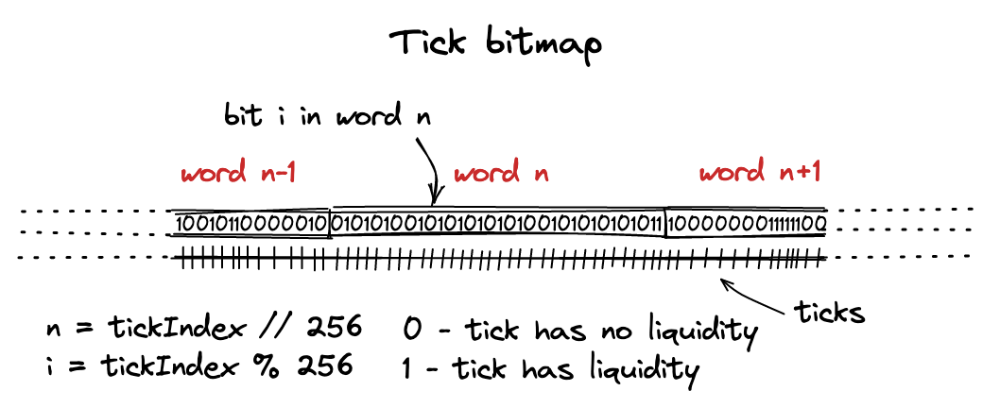

# Tick Bitmap Index

作为开始动态交易的第一步，根据交易输入的 `tokens` 数量计算新的价格，根据价格计算交换后的 `tick index`

```solidity
function swap(address recipient, bytes calldata data)
    public
    returns (int256 amount0, int256 amount1)
{
  int24 nextTick = 85184;
  ...
}
```

当流动性在不同的价格区间中时，我们很难简单地**计算**出目标 `tick`。
事实上，我们需要根据不同区间中的流动性来**找到**它。

因此，我们需要对于所有拥有流动性的 `tick` 建立一个索引，
之后使用这个索引来寻找 `tick` 直到“填满”当前交易所需的流动性。

## Bitmap

`Bitmap` 是一个用压缩的方式提供数据索引的常用数据结构。

一个 `bitmap` 实际上就是一个 `0` 和 `1` 构成的数组，
其中的每一位的位置和元素内容都代表某种外部的信息。

每个元素可以被看做是一个 `flag`：当值为 `0` 的时候，`flag` 没有被设置；
当值为 `1` 的时候，`flag` 被设置。

例如，数组 `111101001101001` 就是数字 `31337`。
这个数字需要两个字节来存储（`0x7a69`），而这两字节能够存储 16 个 flag（1字节=8位）。

`UniswapV3` 使用这个技术来存储关于 `tick` 初始化的信息：

也即哪个 `tick` 拥有流动性。当 `flag` 设置为(`1`)，对应的 `tick` 有流动性；
当 `flag` 设置为(`0`)，对应的 `tick` 没有被初始化，即没有流动性。

## TickBitmap 合约

在池子合约中，`tick` 索引存储为一个状态变量：

```solidity
contract UniswapV3Pool {
    using TickBitmap for mapping(int16 => uint256);
    mapping(int16 => uint256) public tickBitmap;
    ...
}
```

这里的存储方式是一个 `mapping`，`key` 的类型是 `int16`，`value` 的类型是 `uint256`。



数组中每个元素都对应一个 `tick`。为了更好地在数组中寻址，我们把数组按照字的大小划分：每个子数组为 256 位。为了找到数组中某个 tick 的位置，我们使用如下函数：

### Tick.Update
在 添加流动性的时候，需要更新 ticks 上的流动性。
- 如果在当前 ticks 上首次添加流动性，该 ticks index 从 0 置为 1
- 如果移除该位置的流动性，该 ticks index 从 1 置为 0 
```solidity
library Tick {
    struct Info {
        bool initialized;
        uint128 liquidity;
    }

    function update(
        mapping(int24 => Tick.Info) storage self,
        int24 tick,
        uint128 liquidityDelta
    ) internal returns (bool flipped) {
        Tick.Info storage tickInfo = self[tick];
        uint128 liquidityBefore = tickInfo.liquidity;
        uint128 liquidityAfter = liquidityBefore + liquidityDelta;

        flipped = (liquidityAfter == 0) != (liquidityBefore == 0);
```
### 翻转 Tick index 的值
`flipTick` 这是一个 `internal` 函数，用于翻转 `tick` 的状态。它接收：

- self: 一个映射，每个 `int16`（`word` 位置）对应一个 `uint256`（`256 bit`）。
- tick: 要操作的 `tick` 值。
- tickSpacing: `tick` 的间距（确保 `tick` 是合法的间隔点）。

```solidity
    function position(int24 tick) private pure returns (int16 wordPos, uint8 bitPos) {
    wordPos = int16(tick >> 8);
    bitPos = uint8(uint24(tick % 256));
}

/// @notice Flips the initialized state for a given tick from false to true, or vice versa
/// @param self The mapping in which to flip the tick
/// @param tick The tick to flip
/// @param tickSpacing The spacing between usable ticks
    function flipTick(
        mapping(int16 => uint256) storage self,
        int24 tick,
        int24 tickSpacing
    ) internal {
        require(tick % tickSpacing == 0); // ensure that the tick is spaced
        (int16 wordPos, uint8 bitPos) = position(tick / tickSpacing);
        uint256 mask = 1 << bitPos;
        self[wordPos] ^= mask;
    }
```

>     uint256 mask = 1 << bitPos;

构建一个掩码，只有第 `bitPos` 位是 1，例如 `bitPos = 10`，`mask` 就是：
> 000000...00010000000000 (第 10 位是 1)

>     self[wordPos] ^= mask;
这里是关键：

❗为什么用异或 `^=`

这是为了“翻转”某一位：

- 如果原本这一位是 0（未激活），那么 0 ^ 1 = 1，变成激活；

- 如果原本这一位是 1（激活），那么 1 ^ 1 = 0，变成未激活。

即：异或操作相同为 0，不同为 1。

✅ 所以：

第一次调用：tick 被标记为激活。

第二次调用：tick 被取消激活。

可以重复切换状态。

可视化示意图（假设 wordPos = 0）：
```makefile
self[0] = 0x00000000 00000000 00000000 00000000 ...
               ↑
           bitPos = 10

第一次调用: 原始为 0
self[0] ^= 0x00000000 00000000 00000000 00000400 (bit 10 = 1)
结果:      bit 10 被置为 1

第二次调用:
再次异或: 1 ^ 1 = 0
bit 10 被清除
```

### 在Words中寻找Tick的方向
接下来是通过 `bitmap` 索引来寻找带有流动性的 `tick`。

在 swap 过程中，我们需要找到现在 `tick` 左边或者右边的下一个有流动性的 `tick`。

现在使用 `bitmap` 索引来找到这个值, 从下面单个方向展开：

- `tick` 寻找方向（左 or 右） 
- `bit` 的存储顺序（高位 or 低位）
- `tick word` 的排列（内存结构）

#### 🧠 基本术语
`tick`：价格单位刻度。

`word`：`Uniswap` 用一个 `uint256` 来存储 `256` 个 `tick` 是否被初始化（二进制位：0/1）。

`wordPos`：`tick` 所在的 `word`。

`bitPos`：`tick` 在该 `word` 内的位置（0~255）。

#### 🔁 “方向是反的”的含义
✅ 目标行为（直接理解）：

| 操作                   | Tick 变化方向 | sqrtPriceX96 变化 | 价格 (Token1 per Token0) |
| -------------------- | --------- | --------------- | ---------------------- |
| 买入 Token0 (卖 Token1) | Tick ↑ 向右 | 上升              | 上升                     |
| 卖出 Token0 (买 Token1) | Tick ↓ 向左 | 下降              | 下降                     |


#### ⚠️ 实际 bit 顺序问题：
在 `Solidity` 计算 `tick_ bit_pos` 的排列如下（`Big-Endian`)
```text
uint256 bitmap:   [bit255  bit254  ...  bit1  bit0]
bitPos值:          ↑        ↑              ↑   ↑
tick值:         tick=511 tick=510      ... tick=256

        ← tick 增大方向 ←←←←←←←←←←←←←←←←←←←←←
```

也就是说：

| tick 越大 | 存在于 uint256 的越低位 | 实际取值的 bitPos 越小 |
| ------- |------------------|-----------------|
| tick 越小 | 存在于 uint256 的越高位 | 实际取值的 bitPos 越大 |


这就导致：

| 操作行为       | 直接理解方向（tick） | 实际代码方向（bit）                             |
| ---------- |--------------|-----------------------------------------|
| 买入 token X | 价格上涨（tick变大） | 向左（bitPos减小），向bitPos-1、bitPos-2、…0搜索    |
| 卖出 token X | 价格下跌（tick变小） | 向右（bitPos增加），向 bitPos+1、bitPos+2、…255搜索 |

## 计算下一个有效的Tick Index

如果当前 `word` 内不存在有流动性的 `tick`，我们将会在下一个循环中，在相邻的 `word` 中继续寻找。

现在让我们来实现：

```solidity
function nextInitializedTickWithinOneWord(
    mapping(int16 => uint256) storage self,
    int24 tick,
    int24 tickSpacing,
    bool lte
) internal view returns (int24 next, bool initialized) {
    int24 compressed = tick / tickSpacing;
    ...
```

1. `tick` 代表现在的 `tick`；
3. `tickSpaceing` 在本章节中一直为 1；
4. `lte` 是一个设置方向的 `flag`
- 为 `true` 时，我们是卖出 token $x$，在右边寻找下一个 tick；
- false 时相反。

```solidity
if (lte) {
    (int16 wordPos, uint8 bitPos) = position(compressed);
    uint256 mask = (1 << bitPos) - 1 + (1 << bitPos);
    uint256 masked = self[wordPos] & mask;
    ...
```

当卖出 `token` $x$ 时，我们需要：
1. 获得现在 `tick` 的对应位置
2. 求出一个掩码，当前位及所有右边的位为 1
3. 将掩码覆盖到当前 `word` 上，得出右边的所有位

```solidity
    initialized = masked != 0;
    next = initialized
        ? (compressed - int24(uint24(bitPos - BitMath.mostSignificantBit(masked)))) * tickSpacing
        : (compressed - int24(uint24(bitPos))) * tickSpacing;
    ...
```

接下来，`masked` 不为 0 表示右边至少有一个 tick 对应的位为 1。如果有这样的 tick，那右边就有流动性；否则就没有（在当前 word 中）。根据结果，我们要么求出下一个有流动性的 tick 位置，或者下一个 word 的最左边一位——这让我们能够在下一个循环中搜索下一个 word 里面的有流动性的 tick。


```solidity
    ...
} else {
    (int16 wordPos, uint8 bitPos) = position(compressed + 1);
    uint256 mask = ~((1 << bitPos) - 1);
    uint256 masked = self[wordPos] & mask;
    ...
```

类似地，当卖出 $y$ 时：
1. 获取下一个 tick 的位置；
2. 求出一个不同的掩码，当前位置所有左边的位为 1；
3. 应用这个掩码，获得左边的所有位。

同样，如果当前 word 左边没有有流动性的 tick，返回上一个 word 的最右边一位：

```solidity
    ...
    initialized = masked != 0;
    // overflow/underflow is possible, but prevented externally by limiting both tickSpacing and tick
    next = initialized
        ? (compressed + 1 + int24(uint24((BitMath.leastSignificantBit(masked) - bitPos)))) * tickSpacing
        : (compressed + 1 + int24(uint24((type(uint8).max - bitPos)))) * tickSpacing;
}
```

这样就完成了！

正如你所见，`nextInitializedTickWithinOneWord` 并不一定真正找到了我们想要的 tick——它的搜索范围仅仅包括当前 word。事实上，我们并不希望在这个函数里循环遍历所有的 word，因为我们并没有传入边界的参数。这个函数会在 `swap` 中正确运行——我们马上就会看到。
