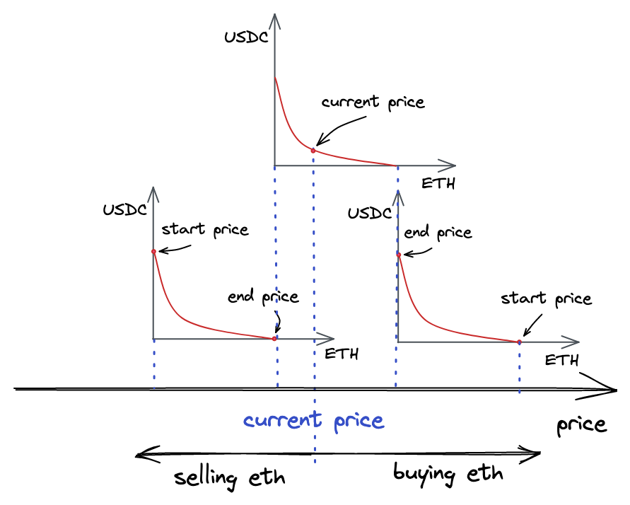

# 跨 tick 交易
## 跨 tick 交易如何工作

一个通常的 `UniswapV3` 池子是一个有很多互相重叠的价格区间的池子。每个池子都会跟踪当前的价格 $\sqrt{P}$ 和 `tick`。

当用户交易 `token`，他们会使得现价和 `tick` 向左或向右移动，移动方向取决于当前的交易方向。
这样的移动是由于交易过程中某种 `token` 被添加进池子或者从池子中移除。

池子同样也会跟踪 $L$（代码中的 `liquidity` 变量），即**所有包含现价的价格区间提供的总流动性**。

通常来说，如果价格移动幅度较大，现价会移出一些价格区间之外。

这些时候，这种价格区间就会变为休眠，并且它们的流动性被从 $L$ 中减去。

另一方面，如果现价进入了某个价格区间，这个价格区间就会被激活并且 $L$ 会增加。

让我们来分析这样一个场景：



在图中有三个价格区间。最上面的一个是现在参与交易的区间，因为它包含现价。这个价格区间的流动性存储在池子合约中的 `liquidity` 变量中。

如果我们买走了最上面价格区间中的所有 `ETH`：
- 价格会升高并且我们会移动到右侧的价格区间中
- 右侧这个区间此时只往外兑 `ETH`
  - 如果现在流动性已经足够满足我们的交易需求
    - 停留在这个价格区间中
    - `liquidity` 变量仅包含当前价格区间的所有流动性
  - 如果持续购买 `ETH` 并且耗尽右边价格区间中的流动性
    - 需要跳到此价格区间右侧的另一个价格区间
    - 如果那里没有其他价格区间了，就不得不停下来，这笔交易将仅会部分成交

如果我们从最上面的价格区间中买走所有的 `USDC`：
- 价格会下降并且我们会移动到左边的价格区间中
- 左侧区间此时仅包含 `USDC`
  - 如果我们耗尽这个区间，就还需要再往左边的一个区间

**_现价会在交易过程中移动。它从一个价格区间移动到另一个价格区间，但是它一定会在某个价格区间之内——否则，就没有流动性可以交易。_**

> 当然，价格区间之间是可以重叠的
> 
> 在价格区间重叠的部分，价格会移动得更缓慢。这是因为在这样的区域中供给量更高，所以需求的影响就会降低。
> 
> 所以在实际中，直接在两个价格区间之间转移不太可能发生。

## 更新 SwapMath.computeSwapStep 函数

在 `swap` 函数中，我们会沿着已初始化的 `tick`（有流动性的 `tick`）循环，直到用户需求的数量被满足。
在每次循环中，我们会：
1. 使用 `tickBitmap.nextInitializedTickWithinOneWord` 来找到下一个已初始化的 `tick`；
2. 在现价和下一个已初始化的 `tick` 之间进行交易（使用 `SwapMath.computeSwapStep`）；
3. 总是假设当前流动性足够满足这笔交易（也即交易后的价格总在现价与下一个 `tick` 对应的价格之间）

### 计算当前的价格区间内能够兑换的最大tokens数量
```solidity
       bool zeroForOne = sqrtPriceCurrentX96 >= sqrtPriceTargetX96;

        amountIn = zeroForOne
            ? Math.calcAmount0Delta(
                sqrtPriceCurrentX96,
                sqrtPriceTargetX96,
                liquidity
            )
            : Math.calcAmount1Delta(
                sqrtPriceCurrentX96,
                sqrtPriceTargetX96,
                liquidity
            );
```

需要考虑以下几个场景： 
- 当现价和下一个 tick 之间的流动性足够填满 `amoutRemaining`
  - 当前 `swap` 交易可以在当前的价格区间内被完成， 根据兑换数量和当前价格计算目标价格
- 当这个区间不能填满 `amoutRemaining`
  - 当前价格区间无法完成完整的 `swap` 交易
    - 将价格区间当道最大，完成当前区间的最大限度的兑换,会消耗掉当前区间所有流动性
    - 剩余代币移动到下一个区间进行兑换

> 首先，计算 `amountIn`——当前区间可以满足的输入数量
> 
> 如果它比 `amountRemaining` 要小，现在的区间不能满足整个交易，因此下一个 $\sqrt{P}$ 就会是当前区间的上界/下界（换句话说，我们使用了整个区间的流动性）。
> 
> 如果 `amountIn` 大于 `amountRemaining`，我们计算 `sqrtPriceNextX96`——一个仍然在现在区间内的价格。 
> 
> 最后，在找到下一个价格之后，我们在这个区间中重新计算 `amountIn` 并计算 `amountOut`。

```solidity
// src/lib/SwapMath.sol
function computeSwapStep(...) {
    if (amountRemaining >= amountIn) sqrtPriceNextX96 = sqrtPriceTargetX96;
    else
        sqrtPriceNextX96 = Math.getNextSqrtPriceFromInput(
            sqrtPriceCurrentX96,
            liquidity,
            amountRemaining,
            zeroForOne
        );

    amountIn = Math.calcAmount0Delta(
        sqrtPriceCurrentX96,
        sqrtPriceNextX96,
        liquidity
    );
    amountOut = Math.calcAmount1Delta(
        sqrtPriceCurrentX96,
        sqrtPriceNextX96,
        liquidity
    );
}
```
## 更新 `swap` 函数

第二个分支是处理了交易仍然停留在当前区间的情况
```solidity
            else if (state.sqrtPriceX96 != step.sqrtPriceStartX96) {
                state.tick = TickMath.getTickAtSqrtRatio(state.sqrtPriceX96);
            }
```

现在，在 `swap` 函数中：当价格移动到了当前区间的边界处。此时，离开的流动性区间休眠，并激活下一个区间。

并且我们会开始下一个循环并且寻找下一个有流动性的 tick。

- `state.sqrtPriceX96` 是新的现价，即在上一个交易过后会被设置的价格；
- `step.sqrtNextX96` 是下一个已初始化的 `tick` 对应的价格。
  - 如果它们相等，说明我们达到了这个区间的边界。
  - 此时需要更新 $L$（添加或移除流动性）并且使用这个边界 `next_tick` 作为现在的 `tick`，继续这笔交易。

```solidity
            if (state.sqrtPriceX96 == step.sqrtPriceNextX96) {
                if (step.initialized) {
                    int128 liquidityDelta = ticks.cross(step.nextTick);

                    if (zeroForOne) liquidityDelta = -liquidityDelta;

                    state.liquidity = LiquidityMath.addLiquidity(
                        state.liquidity,
                        liquidityDelta
                    );

                    if (state.liquidity == 0) revert NotEnoughLiquidity();
                }

                state.tick = zeroForOne ? step.nextTick - 1 : step.nextTick;
            }
```

通常来说，当价格上涨，从左到右穿过穿过一个 `tick` 时：
- 因此，往右穿过一个下界 `tick`，表示进入新的流动性区间，会增加流动性
- 往右穿过一个上界 `tick`，表示离开一个流动性区间，会减少流动性
  - 然而如果 `zeroForOne` 被设置为 `true`，我们会把符号反过来：
    - 当价格下降时，往左跨过上界 `tick`，表示进入新的流动性区间，会增加流动性
    - 往左跨过下界 `tick`，表示离开当前流动性池子， 会减少流动性

当更新 `state.tick` 时:
- 如果价格是下降的（`zeroForOne` 设置为 true）， 我们需要将 tick 减一来走到下一个区间；
- 而当价格上升时（`zeroForOne` 为 false）， 根据 `TickBitmap.nextInitializedTickWithinOneWord`，已经走到了下一个区间了。

另一个重要的改动是，当我们需要在跨过 tick 时更新流动性。全局的更新是在循环之后：

```solidity
if (liquidity_ != state.liquidity) liquidity = state.liquidity;
```

在区间内，我们在进入/离开区间时多次更新 `state.liquidity`。

交易后，我们需要更新全局的 $L$ 来反应现价可用的流动性，同时避免多次写合约状态而消耗 gas。

## 流动性跟踪以及 tick 的跨域

现在让我们来更新 `Tick` 库。

首先要更改的是 `Tick.Info` 结构体：我们现在需要两个变量来跟踪 `tick` 的流动性：

```solidity
struct Info {
    bool initialized;
    // total liquidity at tick
    uint128 liquidityGross;
    // amount of liqudiity added or subtracted when tick is crossed
    int128 liquidityNet;
}
```

- `liquidityGross` 跟踪一个 `tick` 拥有的绝对流动性数量
  - 它用来跟踪一个 tick 是否还可用
- `liquidityNet`，是一个有符号整数
  - 用来跟踪当跨越 `tick` 时添加/移除的流动性数量

`liquidityNet` 在 `update` 函数中设置:
```solidity
function update(
    mapping(int24 => Tick.Info) storage self,
    int24 tick,
    int128 liquidityDelta,
    bool upper
) internal returns (bool flipped) {
    ...

    tickInfo.liquidityNet = upper
        ? int128(int256(tickInfo.liquidityNet) - liquidityDelta)
        : int128(int256(tickInfo.liquidityNet) + liquidityDelta);
}
```

上面我们提到的 `cross` 函数的功能也就是返回 `liquidityNet`（在后面的 milestone 我们引入更多功能时，函数会变得更复杂）：

```solidity
function cross(mapping(int24 => Tick.Info) storage self, int24 tick)
    internal
    view
    returns (int128 liquidityDelta)
{
    Tick.Info storage info = self[tick];
    liquidityDelta = info.liquidityNet;
}
```
