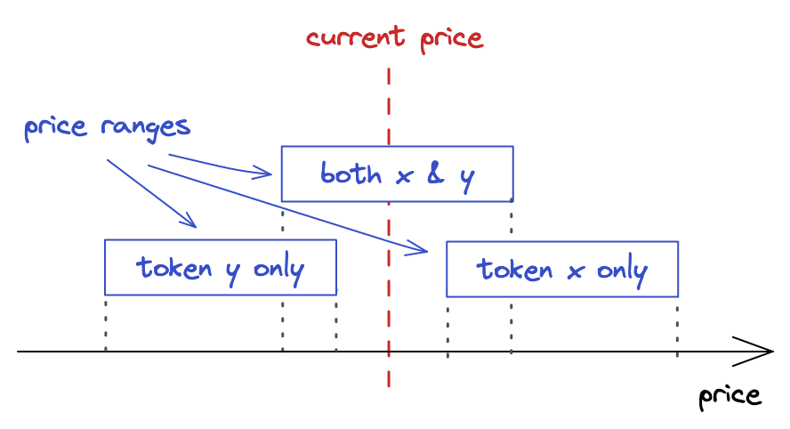

# 不同价格区间

在之前的实现中，仅仅创建包含现价的价格区间：

```solidity
// src/UniswapV3Pool.sol
function mint(
    ...
    amount0 = Math.calcAmount0Delta(
        slot0_.sqrtPriceX96,
        TickMath.getSqrtRatioAtTick(upperTick),
        amount
    );

    amount1 = Math.calcAmount1Delta(
        slot0_.sqrtPriceX96,
        TickMath.getSqrtRatioAtTick(lowerTick),
        amount
    );

    liquidity += uint128(amount);
    ...
}
```

从这段代码中也可以看到，总是会更新流动性 `liquidity`（跟踪现在可用的流动性，即在现价时候可用的流动性）。

然而，也可以创建**低于或高于**现价的价格区间。

`UniswapV3` 的设计允许 `LP` 提供当前不可用的流动性。

这些流动性只有当现价进入这些“休眠”的流动性区间时才会被“激活”。

以下是几种可能存在的价格区间情况：
1. 活跃价格区间，也即包含现价的价格区间；
2. 低于现价的价格区间，该价格区间的上界 `upper_tick` 低于现价 `tick`；
3. 高于现价的价格区间，该价格区间的下界 `lower_tick` 高于现价 `tick`。

## 限价单

一个有趣的事实是：非活跃的流动性（所在区间不包含现价）可以被看做是*限价单(`limit orders`)*。

在交易中，限价单是一种当价格突破用户设定的某个点的时候才会被执行的订单。

例如，你希望开一个限价单，当 `ETH` 价格低于 `$1000` 的时候买入一个 `ETH`。

在 `UniswapV3` 中，你可以通过在非活跃价格区间提供流动性来达到类似的目的。



如果在低于或高于现价的位置提供流动性（整个价格区间都低于/高于现价），
那么你提供的流动性将完全由**一种资产**组成(因此跨 `Tick` 区间交易的时候，只会想要兑换一种 `Token`)。

在我们的例子中，我们的池子是把 `ETH` 作为 `token` $x$，把 `USDC` 作为 `token` $y$ ，我们的价格定义为：

$$P = \frac{y}{x}$$

如果我们把流动性放置在低于现价的区间，那么流动性将只会由 `USDC` 组成，因为当我们添加流动性的时候 `USDC` 的价格低于现价。

类似地，如果我们高于现价的区间提供流动性，那么流动性将完全由 `ETH` 组成，因为 `ETH` 的价格低于现价。

回顾一下我们在简介中的图表：


- 如果我们购买这个区间中所有可用的 `ETH`，这个区间内将只会由另一种 `token`组成:
  - 上个区间的 ETH 不够兑换的话，会进入当前区间的右边继续兑换 `ETH`，也就是右边的区间需要为接下来的交易提供 `ETH` 
    - 如果我们持续购买并且拉高价格，可能会继续“耗尽”下一个价格区间，也即买走它所有的 `ETH` 
- 类似地，如果我们购买 `USDC`，我们会使得价格下跌，价格曲线向左移动并且从池子中移出 `USDC`
  - 下一个价格区间会仅包含 `USDC` 代币来满足需求
    - 并且类似地，如果我们继续买光这个区间的所有 `USDC`，它也会以仅包含 `ETH` 而中止

**_注意到一个有趣的点：当跨越整个价格区间时，其中的流动性从一种 `token` 交易为另外一种。_**

> 并且如果我们设置一个相当窄的价格区间，价格会快速越过整个区间，我们就得到了一个限价单！
> 
> 例如，如果我们想在某个低价点购入 ETH，我们可以在一个低价区间提供仅包含 USDC 的流动性，等待价格越过这个区间。
> 
> 在这之后，我们就可以移出流动性，所有的 USDC 都转换成了 ETH！

## 更新 `mint` 函数

为了支持上面提到的各种价格区间，我们需要知道现价究竟是低于、位于、高于用户提供的价格区间，
并且计算相应的 `token` 数量。
- 如果价格区间高于现价，我们希望它的流动性仅仅由 token $x$ 组成
- 如果价格区间低于现价，我们希望它的流动性仅仅由 token $y$ 组成
- 现价处于当前价格区间，则计算两种代币的数量并且更新当前的流动性
```solidity
        if (slot0_.tick < lowerTick) {
            amount0 = Math.calcAmount0Delta(
                TickMath.getSqrtRatioAtTick(lowerTick),
                TickMath.getSqrtRatioAtTick(upperTick),
                amount
            );
        } else if (slot0_.tick < upperTick) {
            amount0 = Math.calcAmount0Delta(
                slot0_.sqrtPriceX96,
                TickMath.getSqrtRatioAtTick(upperTick),
                amount
            );

            amount1 = Math.calcAmount1Delta(
                slot0_.sqrtPriceX96,
                TickMath.getSqrtRatioAtTick(lowerTick),
                amount
            );

            liquidity = LiquidityMath.addLiquidity(liquidity, int128(amount)); // TODO: amount is negative when removing liquidity
        } else {
            amount1 = Math.calcAmount1Delta(
                TickMath.getSqrtRatioAtTick(lowerTick),
                TickMath.getSqrtRatioAtTick(upperTick),
                amount
            );
        }
```


##  流动性计算

在 `UniswapV3` 的所有数学公式中，只剩流动性计算我们还没在 `Solidity` 里面实现。

```python
def liquidity0(amount, pa, pb):
    if pa > pb:
        pa, pb = pb, pa
    return (amount * (pa * pb) / q96) / (pb - pa)


def liquidity1(amount, pa, pb):
    if pa > pb:
        pa, pb = pb, pa
    return amount * q96 / (pb - pa)
```

### 实现 Token X 的流动性计算
要实现的函数是在已知 `token` 数量和价格区间的情况下计算流动性（$L = \sqrt{xy}$）。

$$\Delta x = (\frac{1}{\sqrt{P_{target}}} - \frac{1}{\sqrt{P_{current}}}) L$$
$$= \frac{L}{\sqrt{P_{target}}} - \frac{L}{\sqrt{P_{current}}}$$


简化之后：
$$L = \frac{\Delta x \sqrt{P_u} \sqrt{P_l}}{\sqrt{P_u} - \sqrt{P_l}}$$

在 `Solidity` 中，我们仍然使用 `PRBMath` 来处理乘除过程中可能出现的溢出：

```solidity
function getLiquidityForAmount0(
    uint160 sqrtPriceAX96,
    uint160 sqrtPriceBX96,
    uint256 amount0
) internal pure returns (uint128 liquidity) {
    if (sqrtPriceAX96 > sqrtPriceBX96)
        (sqrtPriceAX96, sqrtPriceBX96) = (sqrtPriceBX96, sqrtPriceAX96);

    uint256 intermediate = PRBMath.mulDiv(
        sqrtPriceAX96,
        sqrtPriceBX96,
        FixedPoint96.Q96
    );
    liquidity = uint128(
        PRBMath.mulDiv(amount0, intermediate, sqrtPriceBX96 - sqrtPriceAX96)
    );
}
```

### 实现 Token Y 的流动性计算
类似得，我们将使用计算流动性中出现的另一个公式来在给定 $y$ 的数量和价格区间的前提下计算流动性：

$$\Delta y = \Delta\sqrt{P} L$$
$$L = \frac{\Delta y}{\sqrt{P_u}-\sqrt{P_l}}$$

```solidity
function getLiquidityForAmount1(
    uint160 sqrtPriceAX96,
    uint160 sqrtPriceBX96,
    uint256 amount1
) internal pure returns (uint128 liquidity) {
    if (sqrtPriceAX96 > sqrtPriceBX96)
        (sqrtPriceAX96, sqrtPriceBX96) = (sqrtPriceBX96, sqrtPriceAX96);

    liquidity = uint128(
        PRBMath.mulDiv(
            amount1,
            FixedPoint96.Q96,
            sqrtPriceBX96 - sqrtPriceAX96
        )
    );
}
```
### 公平的流动性计算
在计算流动性时有如下逻辑：
1. 如果我们在一个低于现价的价格区间计算流动性，我们使用 $\Delta y$ 版本的公式；
2. 如果我们在一个高于现价的价格区间计算流动性，我们使用 $\Delta x$ 版本的公式；
3. 如果现价在价格区间内，我们两个都计算并且挑选较小的一个。
```solidity
    function getLiquidityForAmounts(
        uint160 sqrtPriceX96,
        uint160 sqrtPriceAX96,
        uint160 sqrtPriceBX96,
        uint256 amount0,
        uint256 amount1
    ) internal pure returns (uint128 liquidity) {
        if (sqrtPriceAX96 > sqrtPriceBX96)
            (sqrtPriceAX96, sqrtPriceBX96) = (sqrtPriceBX96, sqrtPriceAX96);

        if (sqrtPriceX96 <= sqrtPriceAX96) {
            liquidity = getLiquidityForAmount0(
                sqrtPriceAX96,
                sqrtPriceBX96,
                amount0
            );
        } else if (sqrtPriceX96 <= sqrtPriceBX96) {
            uint128 liquidity0 = getLiquidityForAmount0(
                sqrtPriceX96,
                sqrtPriceBX96,
                amount0
            );
            uint128 liquidity1 = getLiquidityForAmount1(
                sqrtPriceAX96,
                sqrtPriceX96,
                amount1
            );

            liquidity = liquidity0 < liquidity1 ? liquidity0 : liquidity1;
        } else {
            liquidity = getLiquidityForAmount1(
                sqrtPriceAX96,
                sqrtPriceBX96,
                amount1
            );
        }
    }
```

## 添加流动性中的滑点保护

添加流动性同样也需要滑点保护, 然而与 `swap` 函数不同的是，我们并不需要在池子合约中实现 `mint` 的滑点保护, 添加流动性的滑点保护是在管理合约中实现的。

管理合约是一个对于核心功能进行包装的合约，使得对于池子合约的调用更加便利。

为了在 `mint` 函数中实现滑点保护，
我们仅需要比较池子实际放入的 `token` 数量与用户选择的最低数量即可。

另外，我们也可以免除用户对于 $\sqrt{P_{lower}}$ 和 $\sqrt{P_{upper}}$ 的计算，在 `Manager.mint()` 中计算它们。

更新后的 `mint` 函数参数更多，我们包装在一个结构体中：

```solidity
// src/UniswapV3Manager.sol
contract UniswapV3Manager {
    struct MintParams {
        address poolAddress;
        int24 lowerTick;
        int24 upperTick;
        uint256 amount0Desired;
        uint256 amount1Desired;
        uint256 amount0Min;
        uint256 amount1Min;
    }

    function mint(MintParams calldata params)
        public
        returns (uint256 amount0, uint256 amount1)
    {
        ...
```

`amount0Min` 和 `amount1Min` 是通过滑点计算出的边界值。

它们必须比 `desired` 值小，其中的差值即为滑点。

`LP` 希望提供的 `token` 数量不少于 `amount0Min` 和 `amount1Min`。

接下来，我们计算 $\sqrt{P_{lower}}$，$\sqrt{P_{upper}}$ 和流动性：

```solidity
    function mint(MintParams calldata params)
        public
        returns (uint256 amount0, uint256 amount1)
    {
        IUniswapV3Pool pool = IUniswapV3Pool(params.poolAddress);

        (uint160 sqrtPriceX96, ) = pool.slot0();
        uint160 sqrtPriceLowerX96 = TickMath.getSqrtRatioAtTick(
            params.lowerTick
        );
        uint160 sqrtPriceUpperX96 = TickMath.getSqrtRatioAtTick(
            params.upperTick
        );

        uint128 liquidity = LiquidityMath.getLiquidityForAmounts(
            sqrtPriceX96,
            sqrtPriceLowerX96,
            sqrtPriceUpperX96,
            params.amount0Desired,
            params.amount1Desired
        );

        (amount0, amount1) = pool.mint(
            msg.sender,
            params.lowerTick,
            params.upperTick,
            liquidity,
            abi.encode(
                IUniswapV3Pool.CallbackData({
                    token0: pool.token0(),
                    token1: pool.token1(),
                    payer: msg.sender
                })
            )
        );

        if (amount0 < params.amount0Min || amount1 < params.amount1Min)
            revert SlippageCheckFailed(amount0, amount1);
    }
```
