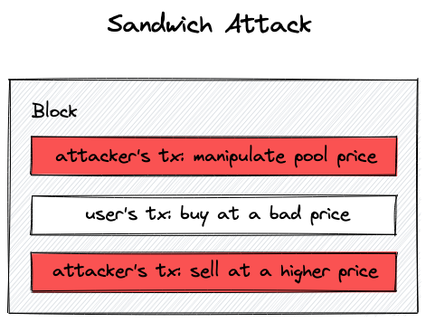

# 滑点保护

滑点(`slippage`)是指在交易之前看到的价格与交易实际执行的价格之间的价差

发出这笔交易和这个交易被打包进区块上链之间有一个延迟,取决于网络拥堵程度和花费的 `gas`

滑点保护解决的另一个很重要的问题是*三明治攻击(`sandwich attacks`，也可以叫夹子攻击)*

通过夹子，攻击者把你的交易包在他自己的两笔交易中间：一笔在你的交易前一笔在你的交易后。

- 在第一笔交易中，攻击者在较低价格购入 `tokens`,推高 `tokens` 价格
- 在被夹的用户交易中，用户被迫在更高的价格购买 `tokens`,并且持续推高 `tokens` 价格
- 在攻击者的第二笔交易中，攻击者用更高的价格卖出 `tokens` 获利
- 但是被攻击者由于被更改的价格而获得了更少的 `token`，对应的利润都到了攻击者手里



滑点保护的实现方式是，**_让用户选择允许实际成交价和看到的价格有多少的价差_**

`UniswapV3` 默认的滑点是 0.1%，意味着仅当实际成交价不低于现在看到价格的 99.9% 时才会成交。

这个限制比较严格，用户可以自行调整滑点的数值，在变动剧烈的时候会很有用。

接下来我们在我们的实现中加入滑点保护。

## 交易中的滑点保护

为了保护交易，我们需要在 `swap` 函数中多加一个参数：

我们希望用户设定一个停机价格，也即交易会中止的价格。我们把这个参数叫做 `sqrtPriceLimitX96`：

```solidity
function swap(
    address recipient,
    bool zeroForOne,
    uint256 amountSpecified,
    uint160 sqrtPriceLimitX96,
    bytes calldata data
) public returns (int256 amount0, int256 amount1) {
    ...
    if (
        zeroForOne
            ? sqrtPriceLimitX96 > slot0_.sqrtPriceX96 ||
                sqrtPriceLimitX96 < TickMath.MIN_SQRT_RATIO
            : sqrtPriceLimitX96 < slot0_.sqrtPriceX96 &&
                sqrtPriceLimitX96 > TickMath.MAX_SQRT_RATIO
    ) revert InvalidPriceLimit();
    ...
```

当卖出 token $x$（`zeroForOne` 设置为 true），`sqrtPriceLimitX96` 必须在现价和最小 $\sqrt{P}$ 之间，因为卖出会使得价格下降。类似地，当卖出 token $y$ 的时候，`sqrtPriceLimitX96` 必须在现价和最大 $\sqrt{P}$ 之间。

在 while 循环中，我们需要满足两个条件：全部的交易数额还未被填满并且现价不等于 `sqrtPriceLimtX96`： 

```solidity
..
while (
    state.amountSpecifiedRemaining > 0 &&
    state.sqrtPriceX96 != sqrtPriceLimitX96
) {
...
```

这意味着，在 `UniswapV3` 中，当滑点达到最大限度的时候并不会使交易失败，而仅仅是交易部分成交。

另一个我们需要考虑滑点的地方是调用 `SwapMath.computeSwapStep` 时：

```solidity
(state.sqrtPriceX96, step.amountIn, step.amountOut) = SwapMath
    .computeSwapStep(
        state.sqrtPriceX96,
        (
            zeroForOne
                ? step.sqrtPriceNextX96 < sqrtPriceLimitX96
                : step.sqrtPriceNextX96 > sqrtPriceLimitX96
        )
            ? sqrtPriceLimitX96
            : step.sqrtPriceNextX96,
        state.liquidity,
        state.amountSpecifiedRemaining
    );
```

在这里，我们需要确保 `computeSwapStep` 不会计算出一个超过滑点的交易数量——这保证了现价永远不会越过限制价格。