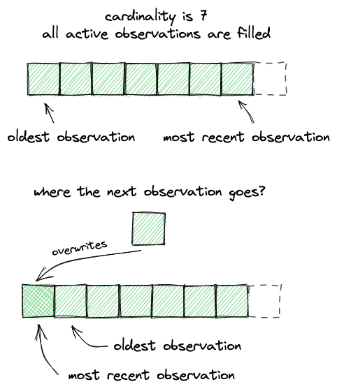
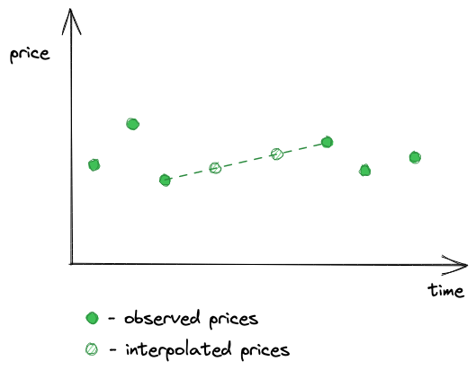

# 价格预言机

要在 `DEX` 中添加的最后一个机制就是*价格预言机*。
## 什么是价格预言机？

价格预言机(`Price Oracle`)是向区块链提供资产价格的一种机制。

## Uniswap 价格预言机如何工作

`Uniswap` 仅仅记录了所有之前的交易价格，就是这样。但是 Uniswap 并没有直接使用实际价格，而是跟踪*累积价格*，也即这个池子合约历史中每秒的价格之和。

$$a_{i} = \sum_{i=1}^t p_{i}$$

这个方法让我们能够找到两个时间点($t_1$ 和 $t_2$)之间的*时间加权平均价格(TWAP)*，只需要将这两个时间点的累积价格($a_{t_1}$ 和 $a_{t_2}$)相减，除以他们之间相隔的秒数即可：

$$p_{t_1,t_2} = \frac{a_{t_2} - a_{t_1}}{t_2 - t_1}$$

`Uniswap V2` 中是这样工作的。

在 `V3` 中，略有一些不同。累积的价格通过 `tick` 来计算的（也即价格的 $log_{1.0001}$）：

$$a_{i} = \sum_{i=1}^t log_{1.0001}P(i)$$

而且不再是直接平均价格，而是采用*几何平均数*：

$$ P_{t_1,t_2} = \left( \prod_{i=t_1}^{t_2} P_i \right) ^ \frac{1}{t_2-t_1} $$

为了求出两个之间点之间的时间加权几何平均价格，我们用这两个时间点的累积价格详见，除以两点之间的秒数差，然后计算 $1.0001^{x}$：

$$ log_{1.0001}{(P_{t_1,t_2})} = \frac{\sum_{i=t_1}^{t_2} log_{1.0001}(P_i)}{t_2-t_1}$$
$$ = \frac{a_{t_2} - a_{t_1}}{t_2-t_1}$$

$$P_{t_1,t_2} = 1.0001^{\frac{a_{t_2} - a_{t_1}}{t_2-t_1}}$$

`Uniswap V2` 并不存储历史累积价格，这就需要第三方的链上数据服务来自行存储并计算平均价格。

而 `Uniswap V3`，允许存储最多 `65535` 个历史累积价格，使得获取历史时间加权几何平均价格更容易。

## 减轻价格操控

另一个重要的点是价格操控，以及如何在 `Uniswap` 中减小它的影响。

理论上，我们可以操纵池子的价格来获得利益：例如，买走大量的 token 来提高价格，然后从使用 Uniswap 价格预言机的第三方服务中获取利润，最后卖出 token 回到原价。为了减少这样的攻击，Uniswap 跟踪**区块结束时**的价格，在一个区块的最后一笔交易*之后*。这消除了在同一个区块内部的价格操纵的可能性。

实际上，Uniswap 预言机中的价格在每个区块的头部更新，并且每个价格在区块的第一笔交易之后计算。

## 价格预言机的实现

现在让我们开始代码部分。

### 观测和基数

我们首先创建 `Oracle` 库，以及 `Observation` 结构体：

```solidity
// src/lib/Oracle.sol
library Oracle {
    struct Observation {
        uint32 timestamp;
        int56 tickCumulative;
        bool initialized;
    }
    ...
}
```

*一个观测(observation)*是存储一个记录价格的 slot。它存储一个价格，记录这个价格时的时间戳，以及一个 `initialized` 标志位，当这个观测被激活时设置为 true（并不是所有的观测都默认激活）。一个池子合约能够存储至多 65535 个观测：

```solidity
// src/UniswapV3Pool.sol
contract UniswapV3Pool is IUniswapV3Pool {
    using Oracle for Oracle.Observation[65535];
    ...
    Oracle.Observation[65535] public observations;
}
```

然而，由于存储这么多 `Observation` 的实例会需要大量的 gas（总有人要为大量合约存储的写操作付款），一个池子默认只存储一个观测，每次新价格记录时都会把它覆盖掉。激活的观测数量，也即观测的*基数(cardinality)*，可以由任何愿意付款的人在任何时间增加。为了管理基数，我们需要一些额外的状态变量：

```solidity
    ...
    struct Slot0 {
        // Current sqrt(P)
        uint160 sqrtPriceX96;
        // Current tick
        int24 tick;
        // Most recent observation index
        uint16 observationIndex;
        // Maximum number of observations
        uint16 observationCardinality;
        // Next maximum number of observations
        uint16 observationCardinalityNext;
    }
    ...
```

- `observationIndex` 记录最新的观测的编号；
- `observationCardinality` 记录活跃的观测数量；
- `observationCardinalityNext` 记录观测数组能够扩展到的下一个基数的大小。

观测存储在一个定长的数组里，当一个新的观测被存储并且 `observationCardinalityNext` 超过 `observationCardinality` 的时候就会扩展。如果一个数组不能被扩展（下一个基数与现在的基数相同），旧的观测就会被覆盖，例如一个观测存储在下标 0，下一个就存储在下标 1，以此类推。

当池子创建的时候，`observationCardinality` 和 `observationCardinalityNext` 都设置为 1：

```solidity
// src/UniswapV3Pool.sol
contract UniswapV3Pool is IUniswapV3Pool {
    function initialize(uint160 sqrtPriceX96) public {
        ...

        (uint16 cardinality, uint16 cardinalityNext) = observations.initialize(
            _blockTimestamp()
        );

        slot0 = Slot0({
            sqrtPriceX96: sqrtPriceX96,
            tick: tick,
            observationIndex: 0,
            observationCardinality: cardinality,
            observationCardinalityNext: cardinalityNext
        });
    }
}
```

```solidity
// src/lib/Oracle.sol
library Oracle {
    ...
    function initialize(Observation[65535] storage self, uint32 time)
        internal
        returns (uint16 cardinality, uint16 cardinalityNext)
    {
        self[0] = Observation({
            timestamp: time,
            tickCumulative: 0,
            initialized: true
        });

        cardinality = 1;
        cardinalityNext = 1;
    }
    ...
}
```

### 写入观测

在 `swap` 函数中，当现价改变时，一个观测会被写入观测数组：


```solidity
// src/UniswapV3Pool.sol
contract UniswapV3Pool is IUniswapV3Pool {
    function swap(...) public returns (...) {
        ...
        if (state.tick != slot0_.tick) {
            (
                uint16 observationIndex,
                uint16 observationCardinality
            ) = observations.write(
                    slot0_.observationIndex,
                    _blockTimestamp(),
                    slot0_.tick,
                    slot0_.observationCardinality,
                    slot0_.observationCardinalityNext
                );
            
            (
                slot0.sqrtPriceX96,
                slot0.tick,
                slot0.observationIndex,
                slot0.observationCardinality
            ) = (
                state.sqrtPriceX96,
                state.tick,
                observationIndex,
                observationCardinality
            );
        }
        ...
    }
}
```

注意到，这里观测的 tick 是 `slot0_.tick`（而不是 `state.tick`），也即这笔交易之前的价格！它在下一条语句中更新为新的价格。这正是我们之前讨论到的防价格操控机制：Uniswap 记录这个区块第一笔交易**之前**的价格，以及上一个区块最后一笔交易**之后**的价格。

另外要注意到，每个观测都通过 `_blockTimestamp()` 来标识，也即现在区块的时间戳。这意味着如果现在区块已经存在一个观测了，那么价格将不会被记录。如果当前区块没有观测（也即这是本区快中的第一笔 Uniswap 交易），价格才会被记录。这也是防价格操控机制的一部分。

```solidity
// src/lib/Oracle.sol
function write(
    Observation[65535] storage self,
    uint16 index,
    uint32 timestamp,
    int24 tick,
    uint16 cardinality,
    uint16 cardinalityNext
) internal returns (uint16 indexUpdated, uint16 cardinalityUpdated) {
    Observation memory last = self[index];

    if (last.timestamp == timestamp) return (index, cardinality);

    if (cardinalityNext > cardinality && index == (cardinality - 1)) {
        cardinalityUpdated = cardinalityNext;
    } else {
        cardinalityUpdated = cardinality;
    }

    indexUpdated = (index + 1) % cardinalityUpdated;
    self[indexUpdated] = transform(last, timestamp, tick);
}
```

这里我们看到，如当前区块已经存在一个观测，那么将会跳过写。如果现在没有存在这样的观测，我们将会存储一个新的，并且在可能的时候尝试扩展基数。取模运算符(`%`)确保了观测的下标保持在 $[0, cardinality)$ 区间中，并且当达到上界时重置为 0。

接下来，我们来看一下 `transform` 函数：

```solidity
function transform(
    Observation memory last,
    uint32 timestamp,
    int24 tick
) internal pure returns (Observation memory) {
    uint56 delta = timestamp - last.timestamp;

    return
        Observation({
            timestamp: timestamp,
            tickCumulative: last.tickCumulative +
                int56(tick) *
                int56(delta),
            initialized: true
        });
}
```

在这里，我们计算的是累积价格：现在的 tick 乘以上次观测到现在的秒数，并加到上一个累积价格之上。

### 增加基数

现在，让我们来看一下基数是如何扩展的。

任何人在任何时间都可以扩展一个池子中观测的基数，并为此支付 gas。因此，我们需要在池子合约中增添一个新的 public 的函数：

```solidity
// src/UniswapV3Pool.sol
function increaseObservationCardinalityNext(
    uint16 observationCardinalityNext
) public {
    uint16 observationCardinalityNextOld = slot0.observationCardinalityNext;
    uint16 observationCardinalityNextNew = observations.grow(
        observationCardinalityNextOld,
        observationCardinalityNext
    );

    if (observationCardinalityNextNew != observationCardinalityNextOld) {
        slot0.observationCardinalityNext = observationCardinalityNextNew;
        emit IncreaseObservationCardinalityNext(
            observationCardinalityNextOld,
            observationCardinalityNextNew
        );
    }
}
```

以及 Oracle 合约中的一个新函数：

```solidity
// src/lib/Oracle.sol
function grow(
    Observation[65535] storage self,
    uint16 current,
    uint16 next
) internal returns (uint16) {
    if (next <= current) return current;

    for (uint16 i = current; i < next; i++) {
        self[i].timestamp = 1;
    }

    return next;
}
```

在 `grow` 函数中，我们通过把 `timestamp` 值设置为一些非零值来分配这些新的观测。注意到，`self` 是一个 `storage` 的变量，为它的元素分配值会更新数组计数器，并且把这些值写道合约的存储中。

### 读取观测

最后我们来到了这章中最棘手的一个部分：读取观测。在开始之前，我们来复习一下观测是如何存储的，以便于我们更好地理解。

观测是存储在一个长度可扩展的定长数组中：


正如我们上面所说，观测是可以溢出的：如果一个新的观测不能直接塞进数组，写操作会重新从下标0开始，也即最老的观测将会被覆盖：



并不是每个区块都保证存在观测，因为交易并不一定在每个区块中都有。因此，会存在一些区块我们不知道价格，并且这样缺失的观测可能会很多。当然，我们并不希望在我们预言机提供的价格之间有很大空缺，这也是我们为什么使用时间加权平均价格（TWAP）——这样我们可以在没有观测的地方使用平均价格。TWAP 让我们能够做价格*插值*，即在两个观测之间画一条线，每个在这条线上的点都是两个观测之间某个时间戳对应的价格。



因此，读取观测意味着通过时间戳寻找到观测，并且在确实的观测处插值，同时要考虑到观测数组是可以溢出的（即数组中最老的观测可以在最新的观测之后）。由于我们并不是用时间戳作为下标来索引观测（为了节省 gas），我们需要使用[二分查找算法](https://en.wikipedia.org/wiki/Binary_search_algorithm)来更有效地查找。但并不总是如此。

让我们来把它拆解成更小的步骤，首先来实现 `Oracle` 库中的 `observe` 函数：

```solidity
function observe(
    Observation[65535] storage self,
    uint32 time,
    uint32[] memory secondsAgos,
    int24 tick,
    uint16 index,
    uint16 cardinality
) internal view returns (int56[] memory tickCumulatives) {
    tickCumulatives = new int56[](secondsAgos.length);

    for (uint256 i = 0; i < secondsAgos.length; i++) {
        tickCumulatives[i] = observeSingle(
            self,
            time,
            secondsAgos[i],
            tick,
            index,
            cardinality
        );
    }
}
```

这个函数接受当前区块时间戳，我们希望获取价格的时间点列表(`secondsAgo`)，现在的 tick、观测下标以及基数，作为参数。

接下来看一下 `observeSingle` 函数：

```solidity
function observeSingle(
    Observation[65535] storage self,
    uint32 time,
    uint32 secondsAgo,
    int24 tick,
    uint16 index,
    uint16 cardinality
) internal view returns (int56 tickCumulative) {
    if (secondsAgo == 0) {
        Observation memory last = self[index];
        if (last.timestamp != time) last = transform(last, time, tick);
        return last.tickCumulative;
    }
    ...
}
```

在请求观测时，我们需要在二分查找之前进行一些检查：
1. 如果请求的时间点是最新的观测，我们可以返回最新观测中的数据；
2. 如果请求的时间点是在最新的观测之后，我们可以调用 `transform` 来找到当前时间点上的累积价格（根据最新的观测）；
3. 如果请求的时间点在最新观测之前，我们需要使用二分查找。

上面的代码片段执行了前两点，`secondsAgo == 0` 即代表请求当前区块的观测。接下来我们来看第三点：

```solidity
function binarySearch(
    Observation[65535] storage self,
    uint32 time,
    uint32 target,
    uint16 index,
    uint16 cardinality
)
    private
    view
    returns (Observation memory beforeOrAt, Observation memory atOrAfter)
{
    ...
```

这个函数参数为现在的区块时间戳（`time`），请求价格的时间点（`target`），以及现在观测的索引和基数。它返回两个观测的区间，请求的时间点就在这个区间之中。

在初始化二分查找过程中，我们设置边界：

```solidity
uint256 l = (index + 1) % cardinality; // oldest observation
uint256 r = l + cardinality - 1; // newest observation
uint256 i;
```

记得观测数组是可以溢出的，因此我们上面使用了模运算。

然后我们进入一个循环，每次检查区间的中点：如果它没有初始化（那里没有观测），我们将会进入下一个循环：

```solidity
while (true) {
    i = (l + r) / 2;

    beforeOrAt = self[i % cardinality];

    if (!beforeOrAt.initialized) {
        l = i + 1;
        continue;
    }

    ...
```

如果这个点已初始化，我们把它当做我们请求时间点所在区间的左边界。接下来我们尝试去验证右边界（`atOrAfter`）:

```solidity
    ...
    atOrAfter = self[(i + 1) % cardinality];

    bool targetAtOrAfter = lte(time, beforeOrAt.timestamp, target);

    if (targetAtOrAfter && lte(time, target, atOrAfter.timestamp))
        break;
    ...
```

如果我们已经找到了边界，我们就直接返回。否则我们继续搜索：

```solidity
    ...
    if (!targetAtOrAfter) r = i - 1;
    else l = i + 1;
}
```

在找到请求时间点所在的观测区间后，我们需要计算请求时间点的价格：

```solidity
// function observeSingle() {
    ...
    uint56 observationTimeDelta = atOrAfter.timestamp -
        beforeOrAt.timestamp;
    uint56 targetDelta = target - beforeOrAt.timestamp;
    return
        beforeOrAt.tickCumulative +
        ((atOrAfter.tickCumulative - beforeOrAt.tickCumulative) /
            int56(observationTimeDelta)) *
        int56(targetDelta);
    ...
```

这部分很简单，就是求出在这个区间中价格变化的平均速率，乘以从下界到我们需要时间点之间的秒数。这就是我们之前讨论过的插值。

我们最后需要实现的就是池子合约中的一个 public 函数，读取并返回观测：

```solidity
// src/UniswapV3Pool.sol
function observe(uint32[] calldata secondsAgos)
    public
    view
    returns (int56[] memory tickCumulatives)
{
    return
        observations.observe(
            _blockTimestamp(),
            secondsAgos,
            slot0.tick,
            slot0.observationIndex,
            slot0.observationCardinality
        );
}
```

### 解析观测

现在我们来看一下如何解析观测。

我们刚才实现的 `observe` 函数返回一个累积价格的数组，现在我们希望把它们转换成真正的价格。我会在 `observe` 函数的测试中解释如何实现这一点。

在测试中，我在不同区块、不同方向上执行了多笔不同的交易：

```solidity
function testObserve() public {
    ...
    pool.increaseObservationCardinalityNext(3);

    vm.warp(2);
    pool.swap(address(this), false, swapAmount, sqrtP(6000), extra);

    vm.warp(7);
    pool.swap(address(this), true, swapAmount2, sqrtP(4000), extra);

    vm.warp(20);
    pool.swap(address(this), false, swapAmount, sqrtP(6000), extra);
    ...
```

> `vm.warp` 是 Foundry 的一个 cheat code：它使用指定的时间戳产生一个新的区块——2,7,20 这些是区块时间戳。

第一笔交易发生在时间戳为2的区块，第二个在时间戳7，第三个在时间戳20。然后我们可以读取这些观测：

```solidity
    ...
    secondsAgos = new uint32[](4);
    secondsAgos[0] = 0;
    secondsAgos[1] = 13;
    secondsAgos[2] = 17;
    secondsAgos[3] = 18;
    // 注意这里是secondsAgo，所以用20减去，能对应上面的每个时间戳
    int56[] memory tickCumulatives = pool.observe(secondsAgos);
    assertEq(tickCumulatives[0], 1607059);
    assertEq(tickCumulatives[1], 511146);
    assertEq(tickCumulatives[2], 170370);
    assertEq(tickCumulatives[3], 85176);
    ...
```

1. 最早观测的价格是 0，即在池子部署时初始的观测。然而，由于我们设置的基数是 3，我们进行了3笔交易，它被最后一个观测覆盖了。
2. 在第一笔交易中，观测到的 tick 是 85176，也即池子的初始价格——回忆一下，我们观测到的是区块中第一笔交易之前的价格。由于最早的一笔观测被覆盖掉了，这实际上是数组中最早的一个观测。
3. 下一个返回的累计价格是 170370，也即 `85176 + 85194`。前者是之前的累积价格，后者是第一笔交易之后的价格，在下一个区块中被观测到。
4. 下一个累积价格是 511146，即 `(511146 - 170370) / (17 - 13) = 85194`，在第二笔交易和第三笔交易之间的累积价格。
5. 最后，最新的观测是 1607059，也即 `(1607059 - 511146) / (20 - 7) = 84301`，约为 4581 USDC/ETH，这事第二笔交易的价格，在第三笔交易中被观测到。

下面是一个包含了插值的测试样例：观测的时间点不是交易发生的时间点：


```solidity
secondsAgos = new uint32[](5);
secondsAgos[0] = 0;
secondsAgos[1] = 5;
secondsAgos[2] = 10;
secondsAgos[3] = 15;
secondsAgos[4] = 18;

tickCumulatives = pool.observe(secondsAgos);
assertEq(tickCumulatives[0], 1607059);
assertEq(tickCumulatives[1], 1185554);
assertEq(tickCumulatives[2], 764049);
assertEq(tickCumulatives[3], 340758);
assertEq(tickCumulatives[4], 85176);
```

结果对应的价格分别是：4581.03, 4581.03, 4747.6, 5008.91，即对应间隔的平均价格。

> 如何在 Python 中计算这些价格：
> ```python
> vals = [1607059, 1185554, 764049, 340758, 85176]
> secs = [0, 5, 10, 15, 18]
> [1.0001**((vals[i] - vals[i+1]) / (secs[i+1] - secs[i])) for i in range(len(vals)-1)]
> ```