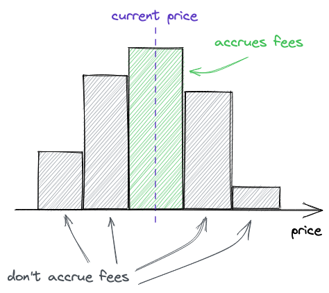

# 交易费率

正如简介中所说，交易费率是 `Uniswap` 的一个核心机制。
- `LP` 需要从提供流动性中获得收益
- 每一笔 `swap` 中都会付出一小笔费用,这些费用将会按提供的流动性占比分配给在交易价格上提供流动性的 `LP`。

## 手续费
在 V2 中，因为大家提供的流动性都是统一的手续费标准（`0.3%`），统一的价格区间(`0, ∞`):
- 所以大家的资金都是均匀分布在整个价格轴之上的， 
- 因此在每一笔交易的过程中，大家收取手续费的权重计算比例也应该是相等的。 
- 即每一笔手续费的收益分配，只基于用户提供的流动性相对于总流动性的比例来分配，出资多的得到的收益多。

然而 V3 的价格区间做市机制，让流动性都有不同的做市区间：
- 也就是说不同的交易价格，使用的流动性是不同的
- 那么这个时候，再用出资比例来分配，是不合适的

正确的方式应该是记录每一笔交易，都使用了哪些流动性头寸 `position(tick_index)`，再将这么些头寸汇总，按比例分配。

这样在理论上来说是合理的，如果是中心化的网络这么干的成本可能承受的起，
但放到区块链的运行环境中，频繁的进行高昂的读写操作是不可行的，会为用户带来极高的 gas 费用，
使得交易的摩擦成本飙升，变得不划算。

## 费率如何收集


交易费用仅仅当一个价格区间在使用中的时候才会被收集到这个区间中。

1. 当价格上升，`tick` 穿过价格区间的下界；表示因为价格上涨，向右进入新的 `tick` 区间；
2. 当价格下降，`tick` 穿过价格区间的上界；表示因为价下跌，向左进入新的 `tick` 区间；

而在下列的时刻一个价格区间被停用：
1. 当价格上升，`tick` 穿过价格区间的上界,表示因为价格上涨离开当前 `tick` 区间；
2. 当价格下降，`tick` 穿过价格区间的下界；


除了知道何时一个区间会被激活/停用以外，还希望能够跟踪每个价格区间累积了多少费用。

为了让费用计算更简单，`Uniswap V3` 跟踪**swap交易产生的总手续费**。

之后，价格区间的费用通过总费用计算出来： **_总手续费减去价格区间之外累计的费用_**。

## 计算 Position(a,b) 累积费用
为了计算一个 `position` 累计的总费用，我们需要考虑两种情况：

### 当现价在这个区间内:

减去到目前为止，这些 `tick` 之外累积的费用：


```math
feeGrowthInside = feeGrowthGlobal - feeGrowthOutside_below - feeGrowthOutside_above
```

`feeGrowthOutside_below` 对应 `(0, a)` 区间， `feeGrowthOutside_above` 对应 `(b, ∞)` 区间。

### 当现价不在这个区间内:
假设我们需要计算 a, b 两点区间内的手续费，此时 `i_current` 当前在 b 点右侧。

| . | . | . | . | . | . | . | . |
| - | - | - | - | - | - | - | - |
| ... |  | a |  | b |  | i | ... |


`i_current` 当前在 b 点右侧，此时 `feeGrowthOutside_b` 实际上记录的是 b 点左侧的手续费，而我们需要计算的 above 应该是 b 点右侧的手续费，所以这里其实是需要用 `feeGrowthGlobal` 减去 `feeGrowthOutside_b`.

```math
feeGrowthOutside_below = feeGrowthOutside_a // a点所对应的tick的feeGrowthOutside
feeGrowthOutside_above = feeGrowthGlobal - feeGrowthOutside_b // b点所对应的tick的feeGrowthOutside
```

代入之前的公式

```math
feeGrowthInside = feeGrowthGlobal - feeGrowthOutside_a - (feeGrowthGlobal - feeGrowthOutside_b)
```

**注意根据 `i_current`, `a`, `b` 三者位置关系不同，需要判断 above 和 below 的计算方式**，具体逻辑在 `Tick.sol` 的 `getFeeGrowInside()` 中。

## 有流动性注入
在价格的边界对应的 `tick` 上有如下初始化规则：

🎯 规则说明

- 当 `tick` <= 当前价格（`i <= i_current`）时，我们认为该 `tick` 是“在上方”。
  - `feeGrowthOutside = feeGrowthGlobal`
- 当 `tick` > 当前价格（`i > i_current`）时，我们认为该 `tick` 是“在下方”。
  - `feeGrowthOutside = 0`

```solidity
        if (liquidityGrossBefore == 0) {
            // by convention, we assume that all growth before a tick was initialized happened _below_ the tick
            if (tick <= tickCurrent) {
                info.feeGrowthOutside0X128 = feeGrowthGlobal0X128;
                info.feeGrowthOutside1X128 = feeGrowthGlobal1X128;
                info.secondsPerLiquidityOutsideX128 = secondsPerLiquidityCumulativeX128;
                info.tickCumulativeOutside = tickCumulative;
                info.secondsOutside = time;
            }
            info.initialized = true;
        }
```

### 🧪 示例 1：
添加流动性区间: `(tickLower=100, tickUpper=200)`

当前` tick（i_current）= 150`

`feeGrowthGlobal = 1000`

初始化两个 tick:

| Tick | 相对位置   | 设置 feeGrowthOutside |
| ---- | ------ |---------------------|
| 100  | ≤ 当前价格 | 1000                |
| 200  | > 当前价格 | 0                   |

```solidity
tick[100].feeGrowthOutside = 1000;
tick[200].feeGrowthOutside = 0;
```

## Cross-tick交易
`feeGrowthOutside` 有如下更新规则：

- 当价格穿过某个已初始化的 `tick` 时，该 `tick` 上的 `feeGrowthOutside` 需要翻转，因为外侧手续费永远要在当前价格的另一侧
- `feeGrowthOutside = feeGrowthGlobal - feeGrowthOutside`

```solidity
    function cross(
        mapping(int24 => Tick.Info) storage self,
        int24 tick,
        uint256 feeGrowthGlobal0X128,
        uint256 feeGrowthGlobal1X128,
        uint160 secondsPerLiquidityCumulativeX128,
        int56 tickCumulative,
        uint32 time
    ) internal returns (int128 liquidityNet) {
        Tick.Info storage info = self[tick];
        info.feeGrowthOutside0X128 = feeGrowthGlobal0X128 - info.feeGrowthOutside0X128;
        info.feeGrowthOutside1X128 = feeGrowthGlobal1X128 - info.feeGrowthOutside1X128;
 ...
```
### 示例 
✅ 基础设定

- 初始全局手续费：`feeGrowthGlobal = 100 `
- 起始 `tick`：`tick = 150 `
- 两段流动性区间（即 `LP` 添加的流动性）： 
  - 区间 `A-B`： `[100, 200)，tick a=100，tick b=200 `
  - 区间 `C-D`： `[300, 400)，tick c=300，tick d=400`

手续费变化过程：

- 价格从 `tick 150` 开始 
- 跨过 `tick 200` → 进入 `tick` 区间 `C-D` 前，还会有一个从 `feeGrowthGlobal = 180` 到 `300` 
- 继续上升后进入区间 `C-D`，`feeGrowthGlobal = 500`

### 阶段 0：初始化时 tick = 150，feeGrowthGlobal = 100
- tick a = 100（左边）⇒ feeGrowthOutside = 100 
- tick b = 200（右边）⇒ feeGrowthOutside = 0 
- tick c = 300（右边）⇒ feeGrowthOutside = 0 
- tick d = 400（右边）⇒ feeGrowthOutside = 0

#### 1 swap在(a,b)
在 `（a,b）`执行 `swap`, `glb = 100 +80 = 180`

```math
feeGrowthInside(a,b) = feeGrowthGlobal - feeGrowthOutside_a - feeGrowthOutside_b = 180 - 100 - 0 = 80
```

#### 2 价格上涨后跨到 （c,d）区间
在 `（a,b）-> (c,d)`执行 `swap`, `glb = 180->300->500`

Cross b: `tick[b].feeGrowthOutside = feeGrowthGlobal - feeGrowthOutside= 300 - 0 = 300`

cross c: `tick[c].feeGrowthOutside = feeGrowthGlobal - feeGrowthOutside= 300 - 0 = 300`

手续费计算：
```solidity
    function getFeeGrowthInside(
        mapping(int24 => Tick.Info) storage self,
        int24 tickLower,
        int24 tickUpper,
        int24 tickCurrent,
        uint256 feeGrowthGlobal0X128,
        uint256 feeGrowthGlobal1X128
    ) internal view returns (uint256 feeGrowthInside0X128, uint256 feeGrowthInside1X128) {
        Info storage lower = self[tickLower];
        Info storage upper = self[tickUpper];

        // calculate fee growth below
        uint256 feeGrowthBelow0X128;
        uint256 feeGrowthBelow1X128;
        if (tickCurrent >= tickLower) {
            feeGrowthBelow0X128 = lower.feeGrowthOutside0X128;
            feeGrowthBelow1X128 = lower.feeGrowthOutside1X128;
        } else {
            feeGrowthBelow0X128 = feeGrowthGlobal0X128 - lower.feeGrowthOutside0X128;
            feeGrowthBelow1X128 = feeGrowthGlobal1X128 - lower.feeGrowthOutside1X128;
        }

        // calculate fee growth above
        uint256 feeGrowthAbove0X128;
        uint256 feeGrowthAbove1X128;
        if (tickCurrent < tickUpper) {
            feeGrowthAbove0X128 = upper.feeGrowthOutside0X128;
            feeGrowthAbove1X128 = upper.feeGrowthOutside1X128;
        } else {
            feeGrowthAbove0X128 = feeGrowthGlobal0X128 - upper.feeGrowthOutside0X128;
            feeGrowthAbove1X128 = feeGrowthGlobal1X128 - upper.feeGrowthOutside1X128;
        }

        feeGrowthInside0X128 = feeGrowthGlobal0X128 - feeGrowthBelow0X128 - feeGrowthAbove0X128;
        feeGrowthInside1X128 = feeGrowthGlobal1X128 - feeGrowthBelow1X128 - feeGrowthAbove1X128;
    }
```

此时， (a,b) 区间的手续费:

当价格已经不在计算的价格区间内时：手续费的计算已经和 总手续费无关，只跟区间的手续费差有关
```text
P_a < P_current, feeGrowthBelow = P_a.feeGrowthBelow = 100
P_a < P_current, feeGrowthAboveX128 = feeGrowthGlobalX128 - P_b.feeGrowthOutsideX128 = 500 - 300 = 200
Fee(a,b) = feeGrowthGlobalX128 - P_a.feeGrowthBelow - feeGrowthGlobalX128 +  P_b.feeGrowthOutsideX128
= P_b.feeGrowthOutsideX128 - P_a.feeGrowthBelow 
= 300 -100 = 200
```

此时， (c,d) 区间的手续费：
```text
P_c < P_current, feeGrowthBelow = P_c.feeGrowthBelow = 300
P_current < P_d, feeGrowthAboveX128 = P_d.feeGrowthOutside128 = 0
Fee(c,d) = 500 - 300 - 0 = 200
```

## 规则回顾
1. 用户 `swap token` 的时候支付费用。输入 `token` 中的一小部分将会被减去，并累积到池子的余额中。
2. 每个池子都有 `feeGrowthGlobal0X128` 和 `feeGrowthGlobal1X128` 两个状态变量，来跟踪每单位的流动性累计的总费用（也即，总的费用除以池子流动性）。
3. `tick` 跟踪在它之外累积的费用
- 当添加一个新的位置并激活一个 tick 的时候
  - tick 位置价格高于现价 slot0.tick, `feeGrowthOutside = 0`
  - tick 位置价格高小于等于现价 slot0.tick, `feeGrowthOutside = fee_global`
4. 每当一个 `tick` 被 `cross` 时,在这个 `tick` 之外积累的费用就会更新为:
- `feeGrowthOutside = feeGrowthGlobal - feeGrowthOutside`
5. `tick` 知道了在他之外累积了多少费用，就可以让我们计算出在一个 `position` 内部累积了多少费用（`position` 就是两个 `tick` 之间的区间）。
6. 知道了一个 `position` 内部累积了多少费用，就能够计算 `LP` 能够分成到多少费用。
- 如果一个 `position` 没有参与到交易中，它的累计费率会是 0
- 在这个区间提供流动性的 LP 将不会获得任何利润。

## 累积交易费用
### 概念说明
🧱 背景概念简述

`tick`：`UniswapV3` 将价格空间离散化为一系列整数 `tick`，价格变动就是 `tick` 的移动。

`feeGrowthGlobal`：表示当前池子整体累计的手续费增长。

`feeGrowthOutside`：记录某个 `tick` 外部（价格另一侧）的手续费累计值，用于精准分配 `LP` 收益。

`i_current`：当前价格对应的 `tick`。

`tick` 边界流动性注入：即为流动性区间设置上下边界（`tick_lower`, `tick_upper`）。

### 添加需要的状态变量
需要做的第一件事是在池子中添加费率参数——每个池子都有一个固定且不可变的费率，在部署时配置。

费率和 `tick` 间隔绑定：费率越高，`tick` 间隔越大。

这是因为稳定性越高的池子（稳定币池）的费率应该更低。

让我们更新工厂合约：
```solidity
// src/UniswapV3Factory.sol
contract UniswapV3Factory is IUniswapV3PoolDeployer {
    ...
    mapping(uint24 => uint24) public fees; // `tickSpacings` replaced by `fees`

    constructor() {
        fees[500] = 10;
        fees[3000] = 60;
    }

    function createPool(
        address tokenX,
        address tokenY,
        uint24 fee
    ) public returns (address pool) {
        ...
        parameters = PoolParameters({
            factory: address(this),
            token0: tokenX,
            token1: tokenY,
            tickSpacing: fees[fee],
            fee: fee
        });
        ...
    }
}
```

费率的单位是基点的百分之一，也即一个费率单位是 `0.0001%`，`500` 是 `0.05%`，`3000` 是 `0.3%`。

下一步是在池子中累积交易费用。为们要添加两个全局费用累积的变量：

```solidity
// src/UniswapV3Pool.sol
contract UniswapV3Pool is IUniswapV3Pool {
    ...
    uint24 public immutable fee;
    uint256 public feeGrowthGlobal0X128;
    uint256 public feeGrowthGlobal1X128;
}
```

### 在 tick 中更新费用追踪器

接下来，需要在 `tick` 中更新费用追踪器（当交易中穿过一个 tick 时）：

```solidity
if (state.sqrtPriceX96 == step.sqrtPriceNextX96) {
    int128 liquidityDelta = ticks.cross(
        step.nextTick,
        (
            zeroForOne
                ? state.feeGrowthGlobalX128
                : feeGrowthGlobal0X128
        ),
        (
            zeroForOne
                ? feeGrowthGlobal1X128
                : state.feeGrowthGlobalX128
        )
    );
    ...
}
```

由于此时还没有更新 `feeGrowthGlobal0X128/feeGrowthGlobal1X128` 状态变量，可以把 `state.feeGrowthGlobalX128` 作为其中一个参数传入。`cross` 函数更新费用追踪器：

```solidity
// src/lib/Tick.sol
function cross(
    mapping(int24 => Tick.Info) storage self,
    int24 tick,
    uint256 feeGrowthGlobal0X128,
    uint256 feeGrowthGlobal1X128
) internal returns (int128 liquidityDelta) {
    Tick.Info storage info = self[tick];
    info.feeGrowthOutside0X128 =
        feeGrowthGlobal0X128 -
        info.feeGrowthOutside0X128;
    info.feeGrowthOutside1X128 =
        feeGrowthGlobal1X128 -
        info.feeGrowthOutside1X128;
    liquidityDelta = info.liquidityNet;
}
```

### 更新全局费用追踪器

最后一步，当交易完成时，需要更新全局的费用追踪：

```solidity
if (zeroForOne) {
    feeGrowthGlobal0X128 = state.feeGrowthGlobalX128;
} else {
    feeGrowthGlobal1X128 = state.feeGrowthGlobalX128;
}
```

同样地，在一笔交易中只有一个变量会更新，因为交易费仅从输入 `token` 中收取。

### 更新 position 费用和 token 数量

下一步是计算 `position` 累计的费用和 `token` 数量。

由于一个 `position` 就是两个 `tick` 之间的一个区间，可以使用 `tick` 中的费用追踪器来计算这些值。

得到 `position` 内累积的费用后，就可以更新 `position` 内的费用和数量追踪器了：

```solidity
// src/lib/Position.sol
function update(
    Info storage self,
    int128 liquidityDelta,
    uint256 feeGrowthInside0X128,
    uint256 feeGrowthInside1X128
) internal {
    uint128 tokensOwed0 = uint128(
        PRBMath.mulDiv(
            feeGrowthInside0X128 - self.feeGrowthInside0LastX128,
            self.liquidity,
            FixedPoint128.Q128
        )
    );
    uint128 tokensOwed1 = uint128(
        PRBMath.mulDiv(
            feeGrowthInside1X128 - self.feeGrowthInside1LastX128,
            self.liquidity,
            FixedPoint128.Q128
        )
    );

    self.liquidity = LiquidityMath.addLiquidity(
        self.liquidity,
        liquidityDelta
    );
    self.feeGrowthInside0LastX128 = feeGrowthInside0X128;
    self.feeGrowthInside1LastX128 = feeGrowthInside1X128;

    if (tokensOwed0 > 0 || tokensOwed1 > 0) {
        self.tokensOwed0 += tokensOwed0;
        self.tokensOwed1 += tokensOwed1;
    }
}
```

## 移除流动性
移除流动性。与 `mint` 相对应，我们把这个函数叫做 `burn`。

这个函数允许 `LP` 移除一个 `position` 中部分或者全部的流动性。

除此之外，它也会计算 `LP` 应该得到的利润收入。

然而，实际的 `token` 转移会在另一个函数中实现——`collect`。

### 燃烧流动性

燃烧流动性与铸造相反。
> 为了实现 `burn`，需要重构代码，把 position 管理相关的代码（更新 tick 和 position，以及 token 数量的计算）移动到 `_modifyPosition` 函数中，这个函数会被 `mint` 和 `burn` 使用。


```solidity
function burn(
    int24 lowerTick,
    int24 upperTick,
    uint128 amount
) public returns (uint256 amount0, uint256 amount1) {
    (
        Position.Info storage position,
        int256 amount0Int,
        int256 amount1Int
    ) = _modifyPosition(
            ModifyPositionParams({
                owner: msg.sender,
                lowerTick: lowerTick,
                upperTick: upperTick,
                liquidityDelta: -(int128(amount))
            })
        );

    amount0 = uint256(-amount0Int);
    amount1 = uint256(-amount1Int);

    if (amount0 > 0 || amount1 > 0) {
        (position.tokensOwed0, position.tokensOwed1) = (
            position.tokensOwed0 + uint128(amount0),
            position.tokensOwed1 + uint128(amount1)
        );
    }

    emit Burn(msg.sender, lowerTick, upperTick, amount, amount0, amount1);
}
```

在 `burn` 函数中，首先更新 `position`，并从中移除一定数量的流动性。

接下来，更新这个 `position` 应得的 `token` 数量
- 它包含提供流动性时转入的 `token` 数量以及费用收入。
- 也可以把它看做把 `position` 流动性转换到 `token` 的过程
- 这些 `token` 将不会再被用于流动性，并且可以通过调用 `collect` 函数来赎回：

```solidity
function collect(
    address recipient,
    int24 lowerTick,
    int24 upperTick,
    uint128 amount0Requested,
    uint128 amount1Requested
) public returns (uint128 amount0, uint128 amount1) {
    Position.Info memory position = positions.get(
        msg.sender,
        lowerTick,
        upperTick
    );

    amount0 = amount0Requested > position.tokensOwed0
        ? position.tokensOwed0
        : amount0Requested;
    amount1 = amount1Requested > position.tokensOwed1
        ? position.tokensOwed1
        : amount1Requested;

    if (amount0 > 0) {
        position.tokensOwed0 -= amount0;
        IERC20(token0).transfer(recipient, amount0);
    }

    if (amount1 > 0) {
        position.tokensOwed1 -= amount1;
        IERC20(token1).transfer(recipient, amount1);
    }

    emit Collect(
        msg.sender,
        recipient,
        lowerTick,
        upperTick,
        amount0,
        amount1
    );
}
```
